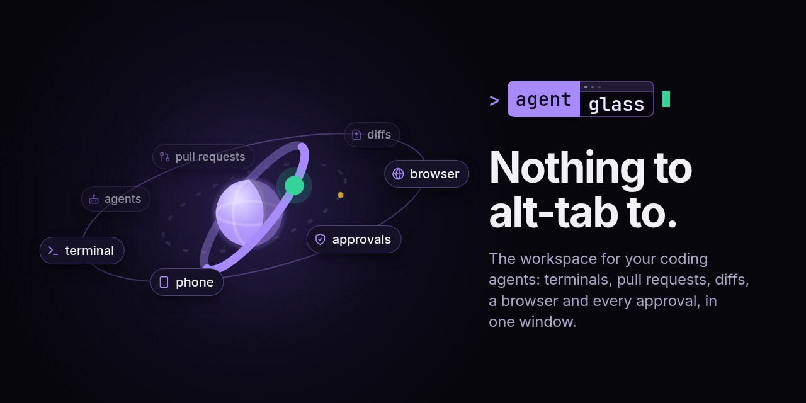

<div align="center">



**The workspace for your coding agents: their terminals, pull requests, diffs, a browser they can drive and every approval they wait on, in one window on your own machine.**

[](https://sirallap.github.io/agentglass/demo/)
[](https://github.com/SirAllap/agentglass/releases/latest)

[](https://github.com/SirAllap/agentglass/releases/latest)
[](https://github.com/SirAllap/agentglass/stargazers)
[](LICENSE)

<a href="https://trendshift.io/repositories/86777" target="_blank"></a>

</div>

Running several agents means living in several apps: a terminal per agent, a
browser tab per pull request, an editor for the diff, a chat window for the
permission prompt, and the phone for the one that got stuck while you were
away. agentglass is one desktop window that holds all of it. Claude Code, Codex,
Gemini CLI and OpenCode keep running where they already run — in tmux, in your
repositories — and everything they touch comes to you there. Nothing to
alt-tab to.

**See it:** [the site](https://sirallap.github.io/agentglass/) walks through it,
and the [live demo](https://sirallap.github.io/agentglass/demo/) is the real
interface running in your browser on sample data.

## 🧰 Without leaving the window

- **Run your agents.** It attaches to the sessions already open in tmux, and it
  can start them: a task or a GitHub issue becomes a worktree, a branch and an
  agent working in it, several at once without colliding. Chat with Claude,
  Codex or Antigravity from a panel, or hand a conversation from one to another.
- **Work in real terminals.** Real tmux panes, your tmux windows as tabs, the
  project's `make` targets and `package.json` scripts one click away.
- **Answer what is waiting on you.** The **Lantern** leads with who needs you:
  red for an agent stopped on a permission gate, amber for one that finished and
  is waiting for you to type. A tool call you chose to gate is held until you
  allow it, from the desk or the phone, and the queue is on disk, so a crash
  cannot silently allow it.
- **Read what the agent wrote.** A diff viewer with word-level changes grouped
  by agent and worktree, and a source-control panel to stage hunks, commit,
  branch, stash and resolve conflicts.
- **Review pull requests to a verdict.** Checks, conversation, files and an
  inline review composer, without opening a browser tab.
- **Give your agents a browser.** A browser panel your agents drive from a CLI
  and an MCP server, already signed in to what you are signed in to.
- **Keep the rest in view.** Docker containers and logs, listening ports and
  the checkout that owns each one, a file browser, CPU and memory, and what
  every session costs and where its time goes.
- **Take it with you.** An Android app paired by a code you scan: the machine's
  terminal panes, the approvals waiting on you, pull requests and a checkout's
  changes, at a scope you grant.
- **Add what is missing.** Plugins are separate processes with a scoped,
  revocable token, installed from an in-app catalogue.

Every view, and what each one is for: [**docs/WORKSPACE.md**](docs/WORKSPACE.md).

## 💻 Platforms

| Platform | Status | You want | Worth knowing |
| --- | --- | --- | --- |
| **Linux** | ✅ Working | `.AppImage` · `.deb` | — |
| **macOS** | ✅ Working, unsigned | `.dmg` — Apple silicon & Intel | One `xattr` command on first launch, below |
| **Windows** | 🧪 Not verified on real metal | `.exe` | Builds and passes CI; a confirmation on hardware is [wanted](https://github.com/SirAllap/agentglass/issues/231) |
| **Android** | ✅ Working | `.apk`, signed | Companion app, paired by a code you scan |

## ⬇️ Install

A desktop app with its own server inside it: nothing to run in a terminal, no
port to open in a browser. Take the build for your platform from
[**Releases**](https://github.com/SirAllap/agentglass/releases/latest) and
launch it.

On macOS the build is not signed yet, so Gatekeeper calls it damaged. It is
not: `xattr -dr com.apple.quarantine /Applications/agentglass.app`, once.

Or run it from source:

```bash
git clone https://github.com/SirAllap/agentglass && cd agentglass
bun install
AGENTGLASS_STATE_DIR=~/.local/state/agentglass-dev bun run dev   # http://localhost:4000, its own database
python3 hooks/install_hooks.py      # so Claude Code reports to it
```

Full instructions, every platform's caveats and the requirements it expects to
find: [**docs/INSTALL.md**](docs/INSTALL.md).

## 🔒 Local, and it stays that way

Your machine holds everything: a SQLite file on your own disk, no account, no
cloud, nothing phoned home. The phone reaches the desk over your own network,
paired by a code you scan, at a scope you choose — read, answer, or full.

Two paths leave the machine and both are opt-in and off by default: a webhook
you configure yourself, and the Explain button, which sends the hunks you point
at to a model. Read [**SECURITY.md**](SECURITY.md) before you install: what is
stored, what is exposed, what each token can do, and every switch that turns a
capability off.

## ❓ FAQ

<details>
<summary><b>Does it replace Claude Code, or my agent?</b></summary>

No. Your agents are the same CLIs you already run. agentglass attaches to the
tmux sessions and repositories already open on your machine, and when it starts
an agent it runs that same CLI, on your machine, with your login. It does not
proxy them — close agentglass and every agent in tmux keeps running.
</details>

<details>
<summary><b>Does anything leave my machine?</b></summary>

No account, no cloud, no telemetry. Everything lives in a SQLite file on your
own disk. Two paths can leave and both are off by default: a webhook you
configure yourself, and the Explain button, which sends the hunks you point at
to a model. [SECURITY.md](SECURITY.md) lists every switch.
</details>

<details>
<summary><b>What do I actually need installed?</b></summary>

**Needed:** git, the Claude Code CLI, and Python 3.
**Per feature:** tmux (chats as live panes, your tmux windows as tabs, theme
sync), the GitHub CLI (the pull-requests panel — and logged in, which is the
step people miss), Docker (containers, images, volumes, logs).

Settings ▸ Requirements checks all of it on your machine and says what stands
down without each one.
</details>

<details>
<summary><b>Why does macOS say the app is damaged?</b></summary>

It is not damaged — the build is not signed yet, and Gatekeeper says that about
anything unsigned. Once: `xattr -dr com.apple.quarantine /Applications/agentglass.app`.
Signing and notarization are the first item on the roadmap.
</details>

<details>
<summary><b>Which agents, and which providers?</b></summary>

**Agents:** Claude Code, Codex, Gemini CLI and OpenCode.
**Providers**, for pointing Claude Code at something else: Kimi, OpenAI, Gemini
and Bedrock — see [docs/INSTALL.md](docs/INSTALL.md).
</details>

## 📚 Documentation

| | |
| --- | --- |
| [**INSTALL.md**](docs/INSTALL.md) | Installing, updating, requirements, the desktop app, the control plane, and running against any provider — Kimi, OpenAI, Gemini, Bedrock |
| [**WORKSPACE.md**](docs/WORKSPACE.md) | Every view and what it is for: the rail, the Clone, the Lantern, the terminal, keyboard shortcuts, themes |
| [**CONFIG.md**](docs/CONFIG.md) | Every environment variable the code reads, the whole HTTP API, and the architecture |
| [**SECURITY.md**](SECURITY.md) | The trust model, what each surface can reach, retention, and how to report a vulnerability |
| [**EXTENDING.md**](docs/EXTENDING.md) | Driving agentglass from your own harness, and writing a plugin |
| [**PLUGINS.md**](docs/PLUGINS.md) | What a plugin is, what it may ask for, and how to publish one |
| [**CHANGELOG.md**](CHANGELOG.md) | What each release changed |
| [**AGENTS.md**](AGENTS.md) | The short version for an agent: driving the built-in browser from a session, and working in this repository. `llms.txt` on the site is the same index for a model |

## 🧩 Two things worth knowing about

**Worktrees start with what git leaves out.** `git worktree add` copies the
tracked tree and nothing else — no `.env`, no local settings — and a new
checkout does not start without them. A `.worktreeinclude` at the repository
root names the ignored paths every worktree agentglass cuts should carry in.

**The terminal has two keyboard tricks.** `Ctrl+Shift+Space` letters the paths,
links, hashes and ids on a pane's screen so one key pastes one back. And
selecting something in a pane offers to ask the agent in that pane about it.

## 🗺 Roadmap

Themes, not dates. The living version is the issue tracker; the
[`help wanted`](https://github.com/SirAllap/agentglass/labels/help%20wanted)
label is where to start.

**Now**
- Lead with a verdict: a one-line strip of what's running, what's stuck and what needs you; the Lantern already covers the rest — [#42](https://github.com/SirAllap/agentglass/issues/42)
- Signing and notarization for the macOS build, so Gatekeeper stops calling it damaged
- Warn when parallel agents collide on shared runtime the diff cannot see — [#118](https://github.com/SirAllap/agentglass/issues/118)

**Next**
- A gate that can hold by rule — a tool allowlist beside the spend threshold that already works — [#109](https://github.com/SirAllap/agentglass/issues/109)
- Per-project gate policies and hook profiles — [#14](https://github.com/SirAllap/agentglass/issues/14)
- Let an agent query the cockpit over MCP: what is running, what it costs, what is held — [#296](https://github.com/SirAllap/agentglass/issues/296)
- Verify the Windows build on real hardware — [#231](https://github.com/SirAllap/agentglass/issues/231)

**Later / exploring**
- Review a local diff in place and send the whole review as one prompt — [#294](https://github.com/SirAllap/agentglass/issues/294)
- An API panel to exercise the endpoints the fleet is building — [#170](https://github.com/SirAllap/agentglass/issues/170)
- A decision log mined from transcripts — [#13](https://github.com/SirAllap/agentglass/issues/13)
- Voice input in chat — [#92](https://github.com/SirAllap/agentglass/issues/92)

Shipped so far, newest first: [**CHANGELOG.md**](CHANGELOG.md) and the
[releases](https://github.com/SirAllap/agentglass/releases).

## 💬 Community

[](https://github.com/SirAllap/agentglass/discussions)
[](https://github.com/SirAllap/agentglass/issues)
[](https://github.com/SirAllap/agentglass/labels/help%20wanted)

## 🤝 Contributing

Issues and PRs welcome — see [CONTRIBUTING.md](CONTRIBUTING.md). Small, fast and
dependency-light on purpose: a Bun/SQLite server, a React/Vite UI, an Electron
desktop shell, a React Native phone app, and a stdlib-only Python hook
forwarder. To adapt it to another agent or harness without forking, start at
[`docs/EXTENDING.md`](docs/EXTENDING.md).

## About

Built by [**@SirAllap**](https://github.com/SirAllap) (David Pallares).
Original work — not a fork. Not affiliated with or endorsed by Anthropic;
"Claude" and "Claude Code" are trademarks of Anthropic.

## License

MIT © 2026 David Pallares — see [LICENSE](LICENSE).

One bundled set of artwork is not MIT: the portrait layers the Understudy draws
are CC BY 4.0, which asks for attribution rather than permission.
[**NOTICE.md**](NOTICE.md) is where that is discharged, and it is the only
reason this repository has a NOTICE at all.
