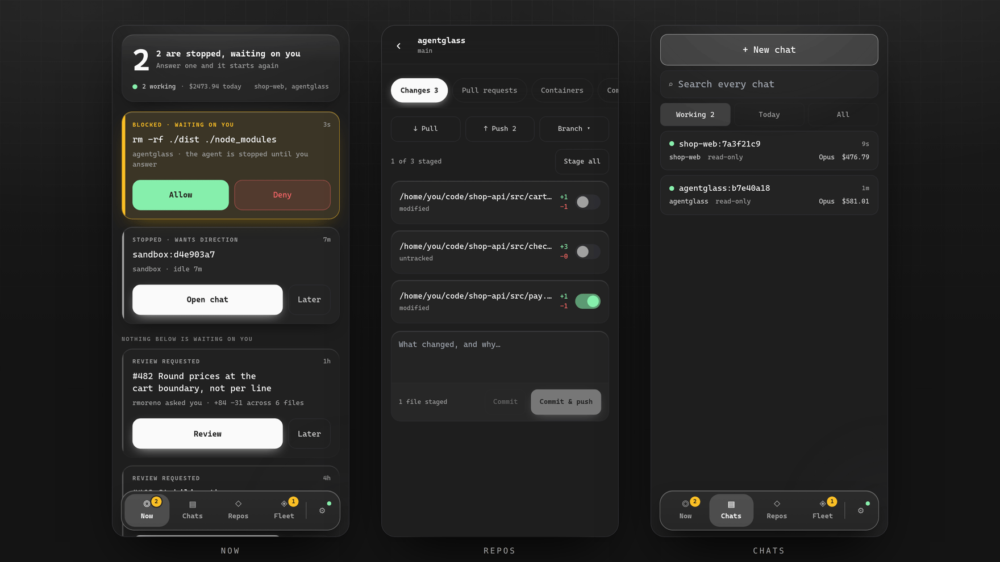

<div align="center">


# agentglass

**Every AI coding agent on your machine, on one screen** — live cost, tokens and tool calls across every provider, and a hold on anything dangerous until you say go. From your desk or your phone.

[](https://sirallap.github.io/agentglass/demo/)

<a href="https://trendshift.io/repositories/86777?utm_source=trendshift-badge&amp;utm_medium=badge&amp;utm_campaign=badge-trendshift-86777" target="_blank" rel="noopener noreferrer"></a>

     


</div>

Point any AI coding agent at agentglass — via Claude Code hooks or any OpenTelemetry GenAI exporter (OpenAI Codex, Gemini CLI, Bedrock, LangChain, LiteLLM…) — and watch every agent, tool call, token, and dollar move in real time. Cost tracking, tool-latency percentiles, error timelines, session lifecycles, one switch that filters the whole cockpit by provider, and 22 themes. It persists across reloads (unlike a pure in-browser stream).

And it's not just a viewer. agentglass carries a full **workspace** in the same cockpit — the idea is simple: browser, terminal, IDE panels, agent telemetry… all in one place. A syntax-highlighted **diff** viewer for everything the fleet changed, a **lazygit**-style source-control panel (stage, commit, push), a **pull-request** panel that reviews and merges without opening a browser, a **lazydocker**-style Docker panel (containers, logs, stats), a **real terminal** (an actual PTY shell on your machine, not an emulation), and a **chat** panel that drives local Claude Code, Codex *and* Antigravity sessions — all behind one keystroke, under a notch that mirrors your desktop notifications so nothing is lost while you are fullscreen. Ships as a **native desktop app**, server included.

### ▶ [**Live demo →**](https://sirallap.github.io/agentglass/demo/)

The full cockpit running on fabricated sample data — a simulated live event
stream, populated radar, spend charts, and even the control-plane approve/deny
gate. No install, no server. *(Everything there is fake; it's a showcase.)*

---

## Contents

- [Every project, one cockpit](#every-project-one-cockpit)
- [More than a dashboard — a workspace](#more-than-a-dashboard--a-workspace)
- [Away from the desk — the phone companion](#away-from-the-desk--the-phone-companion)
- [Why](#why) · [Themes](#themes)
- [Quickstart](#quickstart) · [Requirements](#requirements-what-agentglass-expects-to-find)
- [Desktop app](#desktop-app) · [Updating](#updating)
- [Security model — read this before installing](#security-model--read-this-before-installing)
- [Control plane — approve / deny remotely](#control-plane--approve--deny-tool-calls-remotely-opt-in)
- [Any provider — Kimi, OpenAI, Gemini, Bedrock …](#any-provider--kimi-openai-gemini-bedrock-)
- [Configuration](#configuration-env) · [API](#api) · [Architecture](#architecture)
- [Extending / make it yours](docs/EXTENDING.md)
- [Roadmap](#roadmap) · [Contributing](#contributing) · [License](#license)

---

## Every project, one cockpit

agentglass watches **every** Claude Code session on your machine — you don't
launch it per-repo. Alongside the live hook stream, a **transcript scanner**
reads `~/.claude/projects` directly, so history from every project is there the
moment you open the dashboard, and new sessions tail in live (deduped against
the hooks, so nothing is double-counted).

Want to focus? **Scope the whole cockpit to a single project** — only that repo
(and its worktrees) show up, and its git / terminal / chat panels, diffs, and
spend are all you see. The natural way is the **in-app project picker**: on
first open (a desktop app has no "current folder", so it asks) you choose what
this cockpit is about, and the **⌂ name in the header** switches it any time:

- pick a **project** → that repo and its worktrees, nothing else;
- pick a **folder your projects live in** (e.g. `~/code`) → every repo from
  that folder inward;
- pick **All repos/projects** → no scope at all.

The choice is applied live and **persisted** (`root` in
`~/.config/agentglass/config.json`), so the next launch opens straight into it.
It can also be set from outside:

```bash
AGENTGLASS_ROOT=~/code/my-project bun run dev
# desktop:  AGENTGLASS_ROOT=~/code/my-project agentglass
```

Leave everything unset and it covers the whole machine. You can also pin the
repo sweep to specific directories via `AGENTGLASS_REPO_DIRS`, or the same
config file:

```jsonc
{ "root": "~/code/my-project", "repoDirs": ["~/code", "/mnt/hdd/code"] }
```

---

## More than a dashboard — a workspace

Watching is only half of it. agentglass grew a set of **lazygit / lazydocker-style panels** — plus a real terminal and a Claude chat — that live right in the cockpit, so you can go from *seeing* what the fleet did to *acting* on it without leaving the tab. Keyboard-driven, and they wear the same 22 themes.

They live in one **workspace**: `Ctrl+\` (`⌘\`) opens it over the dashboard, a rail down the left switches between the six views, and `Esc` puts you back. Every view has the same fixed-height title bar and the same list width, so switching changes the panel and nothing else moves.

**Two kinds of shortcut, because they answer different questions.** On the dashboard, bare letters jump straight in — `g` `d` `p` `o` `t` `c`. Inside the workspace every keystroke belongs to whatever has focus, usually a shell, so navigation there carries a modifier: `Ctrl+1`–`Ctrl+6` for the rail in order, `Ctrl+[` / `Ctrl+]` to cycle. Both sets are rebindable in **Settings ▸ Shortcuts**, and the modified one takes any combination you like — `Ctrl+Alt+J` is recorded exactly as you hold it.


**Drag the rail to reorder it.** Put the terminal at the bottom if that is where your thumb goes; `Ctrl+1`–`6` follow your arrangement, so the tooltips never start lying. Drag the seam beside any list to resize it — every view shares that width, and it is remembered.

### 🔔 The notch — what is happening, above everything

A strip across the top of the workspace, always visible, never themed: true black so it disappears into the bezel of an OLED display.

It carries what you would otherwise go looking for — commits **to push** and **to pull**, live **shells**, chats **waiting** on you, unread notifications, your Anthropic **5-hour and weekly plan meters**, a seven-segment clock — and it mirrors **desktop notifications**, so the Slack message that arrives while you are fullscreen is not lost. Click it and it opens downward into an inbox with the full text; click again and it closes. Capability-probed on the server, so a platform without a notification bus gets a notch with no inbox rather than a broken one.

Notifications are off by default and opt-in per level in **Settings ▸ Preferences** — titles only, or the full body.

### 🔬 File changes — a syntax-highlighted diff & review workspace &nbsp;`d`

Every Edit/Write the fleet makes, gathered into one reviewable, chaptered list. **Shiki** syntax highlighting composed with a **word-level** intra-line diff, split or unified, ligatures and a per-diff theme, "reviewed" check-offs — plus one-click **✨ Explain** (a local-Claude walkthrough of the whole change set) and **⎇ Commit…** to turn a review straight into a commit.


### 🌿 Source control — lazygit, in the dashboard &nbsp;`g`

A live view of any repo's working tree (repos are discovered from the fleet's own file paths). Stage / unstage / discard, **interactive hunk staging**, a commit composer, branches (checkout / create / delete), log, reflog, remotes, tags, worktrees and stashes — plus push / pull / fetch. Keyboard-driven (`j/k` move · `s/u` stage · `x` discard · `1`–`8` jump to a tab) and **write-gated**, so it's read-only until you opt in.

It also does the three things you would otherwise drop to a terminal for:

**Sync from base.** Pull `main` into the branch you are on, from the header, with the count of what is waiting. Disabled while the tree is dirty — merging over uncommitted work is how you lose it.

**Resolve conflicts.** Conflicted files are listed as what they are — files git has stopped in the middle of, not ordinary edits — so you cannot commit one with `<<<<<<<` still in it. Take a whole file's `ours`/`theirs` for the lockfile case, or open it **one by one** and choose a side per conflict block — or keep both, in either order — with both versions side by side and the common ancestor when git recorded one. Nothing is written until every block has an answer, because defaulting the ones you did not read is exactly how a merge quietly eats somebody's work.

**Undo the merge**, while that is still exactly reversible — only when nothing is committed on top and nothing is pushed. If either is true the button explains why instead of offering you a lie.


### 🔀 Pull requests — review one without opening a browser &nbsp;`p`


Every open pull request in **one repository at a time** — picked from a repo selector in the panel header, with the repo list discovered from the fleet's own file paths, like the git panel. It opens on **what is waiting on your review**, because that is the question a review dashboard exists to answer; if nothing is waiting it falls through to your own once, so it never lands on an empty pane. **Saved views** — *Needs my review, Mine, Failing, Ready, All* — are a scope and a query under one name, each carrying a live count where the scope is loaded and its last known one everywhere else. Each row carries its checks rolled into one dot (hover for `passed · failed · skipped · running`) and a `here` chip when this checkout is on that branch.

Above the tabs, a **masthead** that survives them: state, number and title, then author, branch, size, reviewers, assignee and milestone, the labels, and a `⋯` menu for the things you do to a pull request rather than in it — retitle, request a review, edit labels, convert to draft, copy the link, hand it to Claude, close it. Open Files and you still know whose change you are reading. Check states arrive in a **second batched pass** after the list itself lands — until it returns the dot is grey and reads `Checks…`, the header says *Loading check states…*, and rows with unknown checks are deliberately kept by the filter rather than hidden. That is what keeps the list itself instant.

**Filter it the way you filter GitHub.** Below the saved views is a query box plus eight multi-select facet menus — **Author, Label, Reviews, Checks, Draft, Base, Assignee, Milestone** — each showing a live count per option, a **Sort** pill, a removable chip per active filter and an "N of M" count. The query string is the single source of truth: `key:value` tokens plus bare words, keys case-insensitive, double quotes for values with spaces (`label:"needs review"`). Keys are `author`, `label`, `review`, `checks`, `is`, `base`, `assignee`, `milestone` and `sort`. Semantics are **OR within a facet, AND across facets** — two authors widens, adding a label then narrows. Bare words match the PR number, title or author, and `sort` takes `recently-updated` (default), `newest`, `oldest`, `most-changed`, `title` or `checks`. Unknown keys, half-typed tokens and unclosed quotes degrade to free text rather than emptying the list. Picking a saved view writes that view's query into the same box, so the chips still show what is on and still take it off again; edit it and the view row says **Custom** rather than claiming you are still in one.

```
author:sirallap label:bug is:draft sort:checks
```

Keyboard-driven both sides: in the list, `j`/`k` (or ↓/↑) move the selection and reset the detail to overview, `/` jumps into the query box, `Esc` clears it. In a PR's **files** tab, `j`/`k` walk the file list, `n`/`p` jump hunk to hunk, `x` marks a file viewed and `↵` folds it — the same keys the File changes modal uses, with the legend on screen. None of them fire while a query or comment box has focus.

Open one and it has **overview · conversation · commits · files · checks · review**. The diff is the app's own viewer — the same `SplitDiff` / `UnifiedDiff` the file-changes panel uses, keybindings and all, rather than a second implementation that drifts — and it reads **per file or per commit**, with merge commits marked as the trunk catch-ups they are so you do not review them as work.

**The conversation is one timeline, and the machines are turned down rather than interleaved.** Reviews, comments, line threads and the events between them read in the order they happened, on a single rail, oldest first or newest first. On a real review, four issue comments were all from CI and one coverage table alone was 46,551 characters, so automation collapses to a digest with the original a click away. Everything a person wrote renders as real markdown at a reading measure, because prose set to the full width of a 2000px window is unreadable however correctly it is formatted. A composer sits at the end, where a conversation ends, with Write and Preview.

**Files opens open.** Every file's diff is expanded from the start — that is how you read a change — and each one mounts as it comes near the viewport, so a sixty-file pull request scrolls instead of stalling; anything over 600 changed lines starts folded, because a regenerated lockfile is not what the tab should open on. Per file there is a **Viewed** switch rather than a tick, since viewed is state you keep for the length of a review, and the bar above carries a path filter, Unified / Split / Wrap, collapse-all and how many of the files you have got through.

**Reviews work the way GitHub's do.** Line comments queue as drafts (a `pending` chip counts them) and go up together as one review — approve, request changes or comment — so a half-finished review never lands in someone's inbox a line at a time. Threads belong to the review that opened them, are anchored to the code they are about, link out when you do want the browser, and the app declines to let you approve your own pull request.

**A PR's overview is also where you act on it.** It leads with whether the thing can land and what is stopping it, each blocker linking to the tab that would fix it. Squash-and-merge (pinned to the head SHA, so a push you have not seen makes GitHub refuse; optionally deleting the branch), enable auto-merge, close, update the branch from base, convert to or from draft, re-run failed checks — merges and closes behind a confirm dialog. The description is **editable in place**, with Write and Preview, and any checklist in it gets a progress bar. And **Review with Claude**: it opens the chat panel on this project with the review prompt already written, pinned to the PR's head SHA and pointed at `gh pr diff` for the change itself. It writes nothing — no fetch, no checkout, no directory left in your repository — and the prompt waits in the composer rather than sending itself, so the run starts when you say so. Same trick behind **Ask Claude why** on a failing check, which hands over the job that broke instead of the whole diff.

Check results notify you only for the pull requests you have a stake in — the ones you authored (**mine**) and the ones waiting on your review. Browsing **all** shows every PR's check state but never pushes a notification, and each PR notifies once per verdict however many checks it runs.

Nothing blocks on the network: the server has one thread, so every read is a cached answer that shows its own age. Check states come back in **one batched GraphQL query** rather than a subprocess per pull request, which is what makes a fifty-row list affordable.

### 🐳 Docker — lazydocker, in the dashboard &nbsp;`o`

Containers, images, volumes and networks in one **stacked column** whose headers never leave — so "is anything dangling?" is answerable without navigating away from the container you are watching. Containers group by compose project with live CPU / memory in aligned columns, and a **dense** toggle drops the image line when you would rather fit more on screen.

Select one and the pane beside it carries **logs · info · env · config · top**, with the logs coloured by level and pinned to the bottom while they stream. **exec** drops you into a shell inside that container — in the console already docked below, so your history and any running job survive it. Start / stop / restart / rm per container, and start / stop / restart across a whole compose project at once (`rm` stays per-container), with each bulk action hidden when it would do nothing. Same keyboard-first feel, same write-gate.


### ▶ Terminal — a real shell, in the dashboard &nbsp;`t`

Not a command-runner imitation: the server opens **your login shell inside a
real PTY** (xterm.js in front, a pseudo-terminal behind a WebSocket), in any
repo/worktree the fleet has touched. Job control, `Ctrl+C` / `Ctrl+R`,
tab-completion, colors, `vim` / `htop` / `lazygit` — everything a local terminal
does. Sessions are **per-repo and persistent**: close the panel mid-build,
reopen later, the job is still running with scrollback intact.

The PTY backend is **POSIX-only**, so on a Windows *host* the Term view is
present but disabled and says why — ConPTY is not implemented yet. The decision
is made on the server, not in the browser, so a Windows *browser* pointed at a
Linux or macOS server still gets a full shell.

The **⚙ commands** menu makes every project command self-explanatory and one
click away — and it covers the **whole selected project**, not just its root:
**Makefile targets with their descriptions** (from `## comment` annotations or
the `# comment` above each target) plus **`package.json` scripts**, discovered
in the repo root *and* its subfolders. A monorepo's nested commands come out
ready to run (`make -C api test`, `bun run --cwd web dev`), grouped by folder
in the menu, each with the right runner (`bun` / `npm` / `pnpm` / `yarn`)
detected from that folder's lockfile. agentglass's own `Makefile` is annotated
this way — `make help` prints the same list in the shell.

Run **tmux** in it and the panel adopts its windows as its own tabs. The list
comes from tmux, the pixels come from agentglass: click to switch, `+` for a new
window, double-click to rename, and tmux's own status line steps aside (one
click brings it back, and it is restored when the panel closes). Nothing about
the keyboard changes — `^b c`, `^b n`, `^b 2` and everything else still go
straight to tmux, and the tabs follow. The point is that the window list stops
being the one strip of the workspace themed by whichever `.tmux.conf` the
machine happens to carry.

**If a shell ever renders solid white,** switch **Settings ▸ Preferences ▸
Terminal renderer** to *Compatibility*. xterm's GPU renderer is fast, but on
some Linux GPU/compositor stacks it paints the terminal blank with no catchable
context-loss event — so the default (**Auto**) uses the GPU on macOS and Windows
and the DOM renderer on Linux. *GPU* forces WebGL back on anywhere; a real
context loss still drops that session to DOM permanently. The choice applies to
newly opened shells, and is separate from `AGENTGLASS_GPU`, which is the
Electron window compositor rather than xterm.


### 💬 Chat — drive Claude, Codex and Antigravity sessions from the browser &nbsp;`c`

Multi-chat against your **local `claude`, `codex` or `agy` CLI**: pick a repo/worktree,
a model, and a permission mode (plan → default / acceptEdits → bypass), then converse —
replies stream in, tool calls appear as chips, and follow-ups resume the same
session. Sessions you start here show up in the fleet like any other agent.

#### Which models the Chat panel offers

Every list is the CLI's own answer rather than a table in this repo. Codex reads
its `models_cache.json`; Antigravity answers `agy models`. Claude Code publishes
no list at all — there is no `claude models` subcommand, no `--list-models`, and
nothing cached on disk — so its catalogue lives in
[`shared/claude-models.json`](shared/claude-models.json).

It is **data, not code**: edit that file and the dropdown follows on the next
request. No rebuild, no restart.

```json
{ "id": "claude-opus-5", "display_name": "Claude Opus 5", "status": "active",
  "release_date": "2026-07-24", "scheduled_shutdown_date": "2027-07-24" }
```

A model is offered until its `scheduled_shutdown_date` has passed — that date is
the last day it appears, so it drops out the day after, and the panel stops
offering retired models without anyone editing anything. `status` is recorded for
the reader and is deliberately *not* a filter: a `superseded` model still answers
until it is actually retired, and hiding it early would remove a choice that
works. A row with no shutdown date never expires, which reads as "no retirement
announced".

To change the list without touching the checkout — a packaged install, or a
read-only one — put your own copy at `~/.config/agentglass/claude-models.json`,
or point `AGENTGLASS_CLAUDE_MODELS` at a file. Ids are validated against the same
expression that guards the spawn, so an entry that could not be sent is never
offered.

#### A second agent: OpenAI Codex

The same panel drives **`codex`** as well. When both CLIs are on the machine an
agent picker appears next to the repo — it is switchable until the chat has a
thread, then frozen, because a resume id belongs to the CLI that minted it and
there is no meaning to handing a live conversation from one to the other.

Codex brings its own vocabulary rather than borrowing Claude's. Its modes are
filesystem sandboxes (**Read-only**, **Write in this repo**, **⚡ Full access**)
instead of per-tool permissions, so there is no allowlist box for a Codex chat —
it decides at the filesystem boundary, not per tool call. The model list is read
from Codex's own `models_cache.json`, so it follows whatever your CLI currently
offers instead of a table in this repo that goes stale on every release. Pasted
and dropped images are Claude-only: `codex exec` takes images as file paths
rather than content blocks, so the panel says so instead of dropping them
silently.

A Codex chat shows **tokens but no cost and no context meter**. `codex exec`
reports neither a price nor a per-turn prompt size, and a bar drawn at 0 / 400k
would be a claim about a session we know nothing about. Its token counts are
cumulative for the whole thread rather than per turn, so they are assigned
rather than added up — and its input count includes the cached part, which is
subtracted back out so the "In" row means the same thing for both agents.

Install and authenticate the Codex CLI separately, then make sure the `codex`
executable is on the server's `PATH` when agentglass starts. The chat panel uses
`codex exec --json` for new turns and `codex exec resume` for follow-ups; it does
not replace the CLI's own login or configuration. Set `CODEX_HOME` when Codex
keeps its state somewhere other than `~/.codex` — the model cache and rollout
history are read from that location. To turn off the Codex integration while
leaving Claude chat available, set `AGENTGLASS_CODEX_DISABLED=1` before starting
the server.

#### A third agent: Google Antigravity

The panel drives **`agy`** as well — Google's agentic CLI, and a **separate
product from the Gemini CLI**: a separate binary with separate state, whose
model list spans Anthropic and open-weight models as well as Google's. Wiring
one does nothing for the other, and the Gemini CLI keeps its own OpenTelemetry
route onto the radar unchanged.

Its four modes line up with Claude's — **Ask**, **Plan**, **Auto-accept edits**,
**⚡ Bypass** — because it really does decide per tool call rather than by
drawing a line around the filesystem. The model list comes from `agy models`, so
it follows whatever your CLI currently offers. Like Codex, it takes images as
file paths rather than content blocks, so pasted images are refused with a
sentence instead of being dropped.

Two honest gaps, both consequences of Antigravity exporting no telemetry of its
own:

- **Only chats started here appear in the fleet.** Claude reports through hooks
  and Codex through OpenTelemetry; Antigravity reports through neither, so
  agentglass turns the frames of the turns *it* runs into events. An `agy` you
  ran in a terminal stays invisible.
- **There is no ↩ resume for it, and no cost or context meter.** Antigravity
  keeps each conversation as a SQLite database of protobuf blobs on an
  undocumented internal schema, so there is no history to replay; and the stream
  reports neither a price nor a context window. Tokens are shown, because those
  it does report.

Install and authenticate the CLI separately, and make sure `agy` is on the
server's `PATH` when agentglass starts. To turn it off while leaving the other
two, set `AGENTGLASS_ANTIGRAVITY_DISABLED=1`.

**↩ resume** picks up a session that already exists — including one you started
in a terminal — with its full context intact, and opens it against the CLI that
created it. Sessions that are still running are listed but can't be picked: a
session has a single owner, and a second writer on the same transcript corrupts
its history. For Codex the replayed history comes from its rollout in
`$CODEX_HOME/sessions` (`~/.codex/sessions` by default), since the OpenTelemetry
stream that puts Codex on the radar carries tool calls but none of the words.

**What a session shows:** the conversation is a **timeline**, not only a chat
log. Tool runs interleave with messages, each tool card carries the head of its
output (so a failing test is distinguishable from a passing one without leaving
the panel), and **subagents** report the parent's session id, so their tool
calls nest under the `Task` call that spawned them and fold away behind a
`… +N tool uses` toggle. Images are sent to the model as image blocks; other
files are quoted into the message. Type `/` in the composer to list and insert
skills/commands (slash commands are enabled in `-p`, they just weren't
discoverable).

---


---

## Away from the desk — the phone companion

The cockpit stays at the desk. A terminal, a hunk-level diff and a docker table
are not things anybody drives with a thumb, and a narrower version of them is
not a phone app — it is the wrong app, smaller. So **a phone gets a different
application**, not a different stylesheet: `main.tsx` chooses one tree or the
other before React mounts. That is also what keeps the phone build honest —
nothing heavy can leak into it. No terminal, no charts, no radar; the fleet's
pulse is fourteen CSS-animated bars rather than a canvas, which on a phone is a
battery decision as much as a layout one.

**What decides.** Width under 768px, or a coarse pointer up to 900px — that
second rule catches the phone held sideways, where the width alone would say
"small laptop". A tablet in landscape is a perfectly good desk and keeps the
cockpit. An explicit choice, stored per device, always wins over both.

### The home screen is a queue, not a dashboard

That is the whole difference: a dashboard is something you re-read, and this is
something you can **empty**. Every card is one decision carrying its own action,
and answering it takes the card out of the list.

| Card | What it is, and what you can do about it |
|---|---|
| **Blocked · waiting on you** | A gate. The agent is stopped dead until you answer, so this outranks everything: allow or deny, with the command it wants to run in front of you. |
| **Container down** | A container that exited non-zero, is restarting, or is dead. Tail the log, restart it, or hand it to Claude. |
| **CI went red** | The failing check on one of your pull requests. Open the log, or re-run it. |
| **Ready to merge** | Approved, checks green, nothing in the way. The one card that finishes work rather than starting it. |
| **Review requested** | Somebody asked for your eyes. Opens the pull request, diff and all. |
| **Stopped · wants direction** | A session that ended its turn and has gone quiet — between four minutes and twelve hours. Under four it is probably still thinking; over twelve it is yesterday's problem, not tonight's. |

Ordered by what it costs you to be away: blocking a person first, then broken,
then finished-and-waiting, then everything else — and within a rank, newest
first. A card you are not going to deal with tonight can be snoozed, and it
comes back when it changes.

### Three tabs, and no more

- **Now** — the queue above.
- **Chats** — say something back. The same conversation you left at the desk,
  and still the same one when you sit back down: the session lives on the
  server, not in a browser tab. Turns stream in as they happen, with the tools
  the agent runs named as it runs them.
- **Repos** — for when you want to look rather than need to. Pick a repository,
  then the facet: **Changes** (a switch per file *is* the staging, then commit
  and push), **Pull requests**, **Containers**. It opens on whatever is wrong.

The diff is unified, wrapped, with a `+` or `−` glyph on every line as well as
the tint — at 11.5px, outdoors, in one hand, colour alone is not a signal to
rely on, and for a good number of people it is not a signal at all.

### Getting it onto your phone

**Settings ▸ Remote access**, one switch to open the port. Then adding a device
is its own small handshake, and it is deliberately not one step.

The pane shows a **QR code and six digits**. Scan the code, type the digits on
the phone, and a request appears back at the computer — naming the device, the
address it came from, and the same six digits — and waits for somebody to
accept. Nothing exists until they do.

That shape is the point. **The QR is an invitation, not a key.** It used to be
the machine's own token, which meant a photograph of this screen, a screenshot
in a chat or a shared window in a call was a working shell on your laptop; there
is no way to scan a code carefully, and being able to see it was the whole
authorisation. Now seeing it gets you a form asking for six digits that are not
in the picture. The credential itself is minted only after a person agrees, and
it is encrypted to a key the phone generated for that one pairing — so on a
network without TLS, everything else on the wifi can watch the entire exchange
and still not have it.

Each device is then **its own thing**: named, at a level you chose while looking
at the request, and revocable on its own.

- **Look only** — sessions, costs, changes, pull requests. Approves nothing.
- **Answer things** *(the default)* — the above, plus approving gates and
  replying to a running session. What a phone is actually for.
- **Everything** — the terminal, git write, Docker, merging. For a laptop you
  trust, not a phone.

**Forget** one device and only that one stops working: its credential is
revoked, the sockets it is holding are closed, and the desk and every other
phone carry on. Rotating the code is still there for when you have lost the code
itself, and still kicks everything.

It is **your network only** — the server binds to the LAN. The same pane will
tell you when a host firewall is dropping the packets, because otherwise the
phone shows a white page and nothing anywhere says why. Over café wifi, pair on
the Tailscale address it offers instead: that one is encrypted end to end.

The page ships a web manifest, so **Add to home screen** gives you an icon that
opens without browser chrome. On an iPhone that is not optional — it is the only
way Safari will deliver a push.

### Reaching it when you are not on the same wifi

The honest answer is **Tailscale**, and it is the one the Remote pane offers
beside the LAN address. A tailnet address is reachable from a train, encrypted
end to end, and limited to devices signed into your own account — which is a
much narrower grant than a network. Install it on both ends, pair on that
address, and the sofa and the airport work the same way.

The tempting answer is a tunnel — `cloudflared`, `ngrok`, a reverse proxy — and
it is worth being plain about what that is. **This server can open a shell, push
to your repositories and control Docker on the machine it runs on.** Putting a
public hostname in front of it means the only thing between the internet and
that is a credential, and credentials leak by being pasted into the wrong
window. Treat the port the way you treat `sshd`: if you must put a proxy in
front of it, terminate TLS there, require authentication at the proxy as well,
and set `AGENTGLASS_ALLOWED_HOSTS` so the DNS-rebinding guard knows the name.
It is not a configuration this project tests, and it is not one to reach for
because Tailscale looked like a bigger setup than it is.

Either way, **the tunnel is for the browser, not for the hooks.** Everything
that reports into agentglass — the Claude Code hooks, the OTel exporters, the
gate that holds a tool call — posts to the server on the machine it is running
on, at `http://localhost:4000`. It has to: the hook scripts refuse to send a
transcript anywhere but this host, precisely because a cloned repository can set
`AGENTGLASS_SERVER` in its own `settings.json` and would otherwise redirect your
prompts and file contents to somebody else. Pointing them at a public hostname
does not make anything work better, and turning off the guard to do it
(`AGENTGLASS_ALLOW_REMOTE=1`) is for the case where the server genuinely runs on
another machine — not for the case where you added a tunnel to it.

### Alerts that reach a locked phone

Everything else agentglass can say needs somebody already looking. A webhook
goes to a chat app, `notify-send` goes to a desktop that may not exist, and the
phone's socket closes with the screen **on purpose** — a socket reconnecting
behind a dark screen is a worse deal than a poll. So the one case the companion
exists for, you walked away and an agent is now blocked waiting on a person,
was the one case nothing covered.

**Settings ▸ Push to this phone**, one switch. After that a held gate buzzes the
phone in your pocket **with Allow and Deny on the notification** — you answer it
from the lock screen and nothing opens. That is the whole loop: an agent stops,
your pocket buzzes, you tap Allow, it goes. Tapping the notification itself
still opens the queue, which is what happens on an iPhone, where Safari draws no
buttons.

Only a held gate gets them. Everything else this app sends is news, and news
with buttons on it is a worse notification rather than a better one.

Answering is bounded by what the device was paired for: a phone paired to
**Look only** is told so rather than silently failing, and the two buttons do
nothing it was not granted — the check is on the route, not on the notification.

It is end-to-end encrypted by design: the push service relays a blob it cannot
read (RFC 8291 over RFC 8188, VAPID for the token). Your machine generates its
own signing key on first use and keeps it in `~/.config/agentglass/push.json`
at 0600 — nothing is registered with anybody, and the only thing that leaves is
ciphertext addressed to your own device.

- **Test** sends a real notification down the real path, so you find out now
  rather than by missing something later.
- More than one device gets a list — what each is called, when it last actually
  received an alert, and a way to forget one. A phone you replaced keeps
  receiving until you say otherwise, and the list is where you say it.
- A held gate stays on the lock screen until you deal with it; anything less
  urgent is allowed to fade.
- Every tap says what it did — including the ones that are not a clean yes. A
  gate somebody already answered at the desk, one that timed out while the phone
  was face-down, a device that has since been forgotten, or a machine that has
  gone to sleep are four different sentences, because they need four different
  things done about them.
- **On iPhone and iPad this needs the Home Screen icon first.** Safari has had
  Web Push since 16.4, but only for an installed site — in a browser tab the
  switch will say so and point at the share sheet.

Independent of `AGENTGLASS_NOTIFY`, which is the desktop channel: a phone is
subscribed whether or not the machine it watches has a screen.

---



## Why

agentglass is a **visibility layer, not a harness**: it doesn't run your agents
or impose a workflow on them — it shows you what they're actually doing, and
puts the controls (diff, commit, terminal, docker) next to what it shows.
Everyone's harness is their own; the missing piece is seeing through it.

Most agent dashboards show a live event feed and forget everything on refresh. agentglass adds the layer that actually answers *"what did this cost, what's slow, what's breaking, and how much of my plan is left?"* — across every provider and every project, wrapped in a fast, animated cockpit.

| Feature | What you get |
|---|---|
| 🛰 **Mission-Control cockpit** | Mission clock, live throughput, tool-mix, a sweeping agent radar (distance from centre = context window used — a blip at the edge is about to compact), plain-English event stream, and a "what needs you" alert center. |
| 🗂 **Every project, machine-wide** | A transcript scanner reads every Claude Code session on the machine — history is there on open, new sessions tail in live. Or scope the whole cockpit to one project (or one folder of projects) with the in-app picker. |
| 🖥 **Native desktop app** | Own window + icon and a **self-contained bundled server** — nothing to run in a terminal. Launch-at-login toggle, attaches to a running server instead of duplicating it. |
| 🔬 **Diff & review** | A real diff viewer for everything the fleet changed — Shiki highlighting + word-level diff, split/unified, AI **Explain**, and commit-straight-from-review. |
| 🌿 **Source control** | lazygit in the cockpit: stage, hunk-stage, commit, branch, stash, push/pull — live on any repo the fleet touched (write-gated). |
| 🐳 **Docker** | lazydocker in the cockpit: containers by compose project, live stats, a log viewer, start/stop/restart (write-gated). |
| ▶ **Real terminal** | A true PTY shell (your login shell) per repo/worktree over a WebSocket — persistent sessions, plus a described, ready-to-run list of every Makefile target & package script across the whole project, grouped by folder. |
| 💬 **Claude chat** | Drive local Claude Code sessions from the browser — model + permission-mode picker, streamed replies, resumable sessions that appear in the fleet. |
| 💰 **Cost & tokens** | Per-event, per-session, per-model USD from a tunable pricing table (input / output / cache-write / cache-read). |
| ⏱️ **Tool latency** | `PreToolUse`→`PostToolUse` pairing → real p50 / p95 / max per tool. |
| 📊 **Persistent analytics** | SQLite-backed. `/stats` over any time window survives reloads and restarts. |
| 🌐 **Any provider** | Claude Code hooks **plus** an OpenTelemetry OTLP receiver (`gen_ai.*` spans). Provider is auto-detected from the model **per event**, so a session that switched models is counted under each provider it actually used — then **filter the entire cockpit** (cost, tools, latency, sessions, radar…) by provider. A model no rule recognises lands in a real **Unknown** bucket you can select, rather than disappearing from every filtered view. |
| 🤖 **Per-model breakdown** | Cost & token split across every model — Claude, GPT, Gemini, and more — from a tunable pricing table. |
| 🧵 **Session lifecycle** | Timeline of every session: start→end, duration, tokens, cost. |
| 📈 **Anthropic plan usage** | 5-hour + weekly plan-limit meters — shown only when you're viewing Anthropic (the one provider with a usage API), on wide screens. |
| ⌨ **Command palette + shortcuts** | `Ctrl-K` to filter, switch theme, change window, export; `d` diffs · `g` git · `p` pull requests · `o` Docker · `t` terminal · `c` chat · `k` skills · `s` stats · `/` search; click any event for full details; click an agent to filter to it. |
| 🎨 **22 themes** | 11 dark palettes (Midnight Purple, Forest, Ember, Nord, …), each with a light twin — instant switch, remembered. |
| 🔔 **Alerts** | Web Push to a locked phone (end-to-end encrypted, no account anywhere) — a held gate arrives with **Allow and Deny on the notification** — plus webhook (Slack/Discord), desktop notify and an optional in-app chime. |
| 💰 **Budgets** | *"No more than $40 a month on this repository."* Per-project and per-model, warned at 80% rather than only when you cross it, counted from the daily rollup as well as live events so a monthly budget really means a month. Settings ▸ Preferences. |
| 📤 **Export** | One-click CSV / JSON of all events. |

### Themes

22 palettes — 11 dark, each with a light twin. A few:

| Forest | Ember | Deep Sea |
|---|---|---|
|  |  |  |

Every dark palette has a matching light twin — e.g. Midnight Purple Light:


---

## Quickstart

agentglass is a **desktop app**. Grab the installer for your platform from
[**Releases**](https://github.com/SirAllap/agentglass/releases/latest), launch
it, and the cockpit opens with its own server bundled inside. Nothing to run in
a terminal, no port to open in a browser.

| Linux | macOS |
| --- | --- |
| `.AppImage` (chmod +x, run it) or `.deb` | `.dmg`, Apple Silicon and Intel |

That alone already shows you everything: the built-in **transcript scanner**
reads `~/.claude/projects`, so every Claude Code session on the machine is
there on first open, with no wiring at all.

To also get live streaming and `PreToolUse` gating, wire the hooks once
(opt-in, details [below](#wire-the-hooks-globally--one-command-opt-in)).

**In the desktop app there is nothing to clone**: the hooks ship inside the
bundle, and **Settings ▸ Hooks** wires them into `~/.claude/settings.json` and
takes them out again, showing whether they are currently installed.

From a checkout, the forwarder lives in the repo, so this path wants a clone and
Python 3; it needs nothing else:

```bash
git clone https://github.com/SirAllap/agentglass.git && cd agentglass
python3 hooks/install_hooks.py        # global Claude Code hooks
python3 hooks/seed_demo.py            # optional: streams demo agents for ~30s
```

> Want to look before installing? The [**live demo**](https://sirallap.github.io/agentglass/demo/)
> is this exact UI, built from the same source on every push, running on
> fabricated data.

### Running from source

For hacking on agentglass, or for a headless box. Requires
[Bun](https://bun.sh) ≥ 1.1 and Python 3 (the hook forwarder and the terminal's
pseudo-terminal both run under it). Everything else agentglass shells out to is
listed under [Requirements](#requirements-what-agentglass-expects-to-find), and
checked for you in Settings ▸ Requirements.

```bash
bun install
bun run dev          # server :4000  +  UI :6180  (vite dev server)
make desktop         # or: build the UI and launch the real shell
```

`bun run dev` gives you the same UI in a browser tab at
**http://localhost:6180**, minus what only the shell can do (fullscreen, zoom,
launch-at-login, and the self-update route, which refuses a browser by design).
It is the development path, not the way to run the app. If something else on
your machine already owns `:4000`, the tab will talk to *that* server, so check
the port before believing an empty dashboard.

**Single-port deploys** (a headless box, a systemd unit): build the UI once and
the server serves it itself, one process, one port, API and dashboard on the
same origin:

```bash
bun run build                         # web/dist
cd server && bun run src/index.ts     # dashboard AND API on :4000
```

When `web/dist` doesn't exist (plain `bun run dev`, or the packaged app's
bundled server), nothing is served over HTTP: the server is API-only and no
dashboard is reachable on that port at all.

Prefer `make`? Every entry point is a described Makefile target, and `make help`
lists them all (`make dev`, `make setup`, `make demo-feed`, `make desktop`, …).
The in-app terminal (`t` → **⚙ commands**) surfaces the same list, ready to
click-run.

### Wire the hooks globally — one command, opt-in

`bun run setup` appends the agentglass forwarder to your **global**
`~/.claude/settings.json`, so **every** Claude Code session — in any project —
starts streaming to the dashboard. No hand-copying, no per-project setup.
(It's deliberately **not** run automatically on `bun install`: touching
`~/.claude` is a decision, so `postinstall` only prints a reminder.) Safe to
re-run:

- **Idempotent & non-destructive** — your existing hooks are preserved; re-running
  only re-points agentglass's own entries (e.g. after moving the clone).
- **Backed up** — the settings file is copied to `*.bak.agentglass.<timestamp>`
  before any change.
- **Auto-labeled** — `--source-app` is omitted so each session shows up under its
  own project's folder name in the dashboard.
- **Takes effect on the next session** — Claude Code loads hooks at startup, so
  open a new session after wiring.

```bash
bun run setup            # wire the global hooks (also: make setup)
bun run setup:undo       # remove the agentglass hooks again
```

> Even without any hooks, the built-in **transcript scanner** already surfaces
> every Claude Code session on the machine — the hooks add live `PreToolUse`
> gating and lower-latency streaming on top.

Prefer to scope it to one project instead of globally? Point the installer at a
project directory (writes `<project>/.claude/settings.json`):

```bash
python3 hooks/install_hooks.py --project ~/code/my-project
```

Both use a dependency-free Python forwarder that POSTs to the server; `Stop` /
`SubagentStop` / `SessionEnd` pass `--add-chat` so token usage can be read from
the transcript. The raw hook blocks also live in
[`hooks/settings.example.json`](hooks/settings.example.json) for manual setups.

---

## Requirements: what agentglass expects to find

agentglass drives the tools you already have rather than bundling its own. The
app itself is self-contained (the server ships inside it), so this list is about
**what each feature shells out to**, and what stands down when it isn't there.

**The app checks all of it for you: Settings ▸ Requirements** shows every tool,
whether this machine has it, what stops working without it, and a link to the
project's own install page. Nothing there installs anything, and the guidance is
deliberately generic: there is one macOS, one Windows and an unbounded number of
Linux distributions, so how you install software is yours to know.

**Needed**

| Tool | Why | Without it |
| --- | --- | --- |
| [git](https://git-scm.com/downloads) | Source control, file changes, pull requests, worktrees; the terminal uses it to decide where to open | Those panels stay empty and the terminal cannot open in a repo |
| [Claude Code CLI](https://docs.claude.com/en/docs/claude-code/setup) | The chat panel runs `claude`: every turn, the pane engine, Review with Claude, the walkthrough | No chatting from the app. Sessions still appear: the transcript scanner reads `~/.claude/projects` regardless |
| [Python 3](https://www.python.org/downloads/) | Runs the hook forwarder, and backs the terminal's pseudo-terminal | Hooks stay wired and fail on every event, so nothing streams live and nothing says why. The terminal still opens, in a mode where full-screen programs do not render. Windows hooks use `py` or `python` |

**Per feature**

| Tool | Gives you | Without it |
| --- | --- | --- |
| [tmux](https://github.com/tmux/tmux/wiki/Installing) | Chats as live panes you can attach to, your tmux windows as tabs, theme sync | Chats run one process per turn instead: slower to start, nothing left running |
| [GitHub CLI](https://cli.github.com) | The whole pull-requests panel | No PRs. It also has to be logged in (`gh auth login`), which is the step people miss |
| [Docker](https://docs.docker.com/get-started/get-docker/) | Containers, images, volumes, logs | No docker panel. The daemon has to be running, not just the CLI installed |
| [Neovim](https://neovim.io) | Sending a file to a live editor, theme sync | The app hands you a command to paste instead |
| setsid, script ([util-linux](https://github.com/util-linux/util-linux)) | Process groups per shell, and the fallback pseudo-terminal | A closed terminal can leave background processes behind |
| [D-Bus tools](https://www.freedesktop.org/wiki/Software/dbus/), [libnotify](https://gitlab.gnome.org/GNOME/libnotify), [xdg-utils](https://www.freedesktop.org/wiki/Software/xdg-utils/) | Mirroring desktop notifications onto the notch, alerts when no window is open, opening their links (Linux) | Those notifications simply do not appear |
| [polkit](https://gitlab.freedesktop.org/polkit/polkit) | Handing a worktree back to you when a container left root-owned files in it | That one repair button fails |

**Two more that are not binaries**

- **Linux `.AppImage`**: needs FUSE, which some distributions no longer install
  by default. The `.deb` has no such requirement.
- **Self-update** ("Install & restart" in Settings ▸ About) builds the new
  version on your machine, so it wants `git`, [Bun](https://bun.sh) and a
  working build toolchain. It is opt-in and never automatic.

**On Windows**, the terminal, tmux chat panes, the notification mirror and
self-update are off by design rather than broken: they need a POSIX
pseudo-terminal, a Unix shell and a D-Bus session respectively. Everything else,
including the transcript scanner and the git and PR panels, works.

---

## Desktop app

agentglass ships as a **desktop app** — its own window and icon, plus a
**self-contained server** (the Bun backend compiled to a standalone binary and
shipped as an [Electron](https://electronjs.org) sidecar), so there's nothing to
run in a terminal. Launch it from your app menu and the cockpit opens; close it
and the server goes with it. The UI is the same web app, run in Chromium so it
composites on the GPU.

Installers for every release are published on
[**Releases**](https://github.com/SirAllap/agentglass/releases/latest):
`.AppImage` and `.deb` for Linux, `.dmg` for macOS (Apple Silicon and Intel).
That is the way to install it.

### macOS: "agentglass is damaged and can't be opened"

On Apple Silicon, macOS may refuse to launch the app with a misleading
**"agentglass.app is damaged and can't be opened"** message. The download is
**not** actually damaged. The `.dmg` is not yet code-signed and notarized with
an Apple Developer ID, so Gatekeeper blocks the quarantined app your browser
downloaded and shows that wording instead of the softer "unidentified developer"
prompt. Clear the quarantine flag with the built-in `xattr` tool, then open it
normally:

```bash
xattr -dr com.apple.quarantine /Applications/agentglass.app
```

Right-click → Open does **not** clear this specific "damaged" variant on Apple
Silicon; only the command above does. Signing and notarization are on the
roadmap (they can run in CI on a macOS runner, so no Mac hardware is needed).
For background, see Apple's [Safely open apps on your
Mac](https://support.apple.com/en-us/102445).

Building it yourself, from a clone:

```bash
make desktop            # build the UI and launch Electron + the sidecar
make desktop-dist       # package installable binaries (electron-builder)
make desktop-install    # install for this user (no root)
```

Then launch **agentglass** from your desktop menu, or `agentglass` from a shell.

The packaged app's bundled server serves the API and nothing else: the UI is
loaded from the shell's own `agentglass://` origin, which a browser cannot
reach, so an install never exposes a dashboard on a port.

- **Attaches, never duplicates** — if a server is already listening on `:4000`
  (e.g. a `bun run dev` you left running), the app attaches to it instead of
  racing a second one against the same database.
- **Clean lifecycle** — the bundled server is a child process, killed when the
  app exits. If the app dies hard, the server's own watchdog notices it was
  orphaned (`AGENTGLASS_DIE_WITH_PARENT`, armed by the shell) and exits rather
  than lingering on the port.
- **Launch at login** — an in-app toggle, no file editing.
- **Keeps full history** — the desktop app defaults `AGENTGLASS_RETENTION_DAYS=0`.

A desktop app launched from its icon has no "current folder" — so on first
open the cockpit **asks which folder it's about**: pick a project, a folder of
projects, or the whole machine, and switch any time from the **⌂ header**. The
choice persists across launches. Prefer to decide at launch time? Pass the
directory instead:

```bash
make desktop-open DIR=~/code/my-project   # or: agentglass ~/code/my-project
```

> Works on **Linux** and **macOS**.

---

## Updating

**Settings ▸ About** shows the version you are running, the commit it was built from, and whether a newer **release** is published. One click builds it and restarts.

**The in-app updater is POSIX-only.** It rebuilds from source, so it needs `git` and `bun` on the machine, and on **Windows** it is switched off rather than shelling out to a `bash` that may not exist — About still reports the version and the newest published tag, but updating means downloading the installer again. When the machine is offline the pane says it could not reach the release feed, instead of claiming you are up to date.


It tracks **tags**, never a branch tip. A tip is wherever development happened to stop — half a feature, a debugging commit — and tagging is the act of saying *this one is tested*. So nothing pushed after the last tag reaches an installed app until you tag it:

```bash
git tag v0.3.0 && git push --tags     # now every install is offered it
```

The build happens in agentglass's **own clone** under `~/.cache/agentglass/source`, never in your checkout — so a convenience button can never move your `HEAD` or touch work in progress. It works out what it already has from `git describe` rather than a version field, so a `package.json` nobody remembered to bump cannot make an older tag look like an upgrade.

The route that runs it is the strictest in the server: reachable from the desktop shell's own origin and nothing else — not from a browser, not from another machine on your network. It is the one endpoint that executes arbitrary code, so the ordinary "local network is fine" rule is not enough for it.

> Updating this way compiles on your machine, which is only reasonable because your machine already has the toolchain. It is not a substitute for a signed release feed, and it is deliberately not automatic — nothing is downloaded or run until you press the button.

## Security model — read this before installing

agentglass is a **workspace, not just a viewer**: it can open a real shell,
write to your repos and control Docker. It ships safe for its intended home —
**your own single-user machine** — and you should know exactly where the lines
are:

- **It only listens on your own machine.** The server binds `127.0.0.1` —
  nothing on your network can reach it. By default there is **no authentication**,
  because on a single-user machine "can reach localhost" already means "is you".
- **Optional shared-secret token.** Set `AGENTGLASS_TOKEN` and every route but
  the append-only telemetry sinks (`/ingest`, the OTLP receivers) requires it —
  `Authorization: Bearer <token>` for the API, `?token=<token>` on the dashboard
  URL (it's stored and stripped from the address bar). This is what makes a
  shared machine or a network bind safe, and it stops *other local processes*
  from opening the shell. Binding a non-loopback address **without** a token
  refuses to run unauthenticated: it mints one, prints it, and saves it
  `0600` under your config dir on POSIX (Linux/macOS). Windows has no POSIX
  mode bits, so there the file falls back to your account's default ACL.
- **Websites you visit can't touch it.** Every request is origin-checked, the
  shell and the live stream require a verified local origin, and a Host-header
  guard blocks DNS-rebinding tricks (browsers can't forge `Host`). Running it
  behind a reverse proxy? Allow its name via `AGENTGLASS_ALLOWED_HOSTS`.
- **⚠️ Shared / multi-user machines are NOT the default home.** `localhost`
  belongs to the *machine*, not to your account — on a box where other people
  also have accounts, any of them could reach the server and its shell **as
  your user**. Set `AGENTGLASS_TOKEN` to lock it to you, and/or disable the
  capability surfaces: `AGENTGLASS_TERMINAL_DISABLED=1`, `AGENTGLASS_FS_BROWSE_DISABLED=1`,
  `AGENTGLASS_CHAT_DISABLED=1`, `AGENTGLASS_CODEX_DISABLED=1`,
  `AGENTGLASS_ANTIGRAVITY_DISABLED=1`, `AGENTGLASS_GIT_WRITE_DISABLED=1`,
  `AGENTGLASS_DOCKER_WRITE_DISABLED=1`.
- **⚠️ Exposing it to a network is a three-part deliberate act.** `AGENTGLASS_BIND=0.0.0.0`
  hands the shell, git write and Docker control to that network. Do it only with
  a token set **and** `AGENTGLASS_TRUST_LAN=1` (off by default, LAN browsers are
  refused as cross-origin without it), and only on a network you fully trust.
  Settings › Remote does all three as one switch, and shows you a QR code —
  including a warning in these words, because the switch is the same decision.
  If a device still can't reach it, the host firewall is dropping the packets:
  the panel names it and prints the command that opens the port to your subnet
  only. Tailnet (Tailscale) addresses count as private under `TRUST_LAN` too.
- **⚠️ Browser-driven autonomy is opt-in.** The Chat panel's unattended modes —
  `bypassPermissions` for Claude (`claude --dangerously-skip-permissions`),
  `full-access` for Codex (`codex --dangerously-bypass-approvals-and-sandbox`)
  and `always-proceed` for Antigravity (`agy --dangerously-skip-permissions`) —
  are honored only when `AGENTGLASS_CHAT_BYPASS=1`. One opt-in covers all three,
  since it is the same decision. Without it Claude is downgraded to a prompting
  default, Codex to its read-only sandbox, and Antigravity to asking.
- **Your data stays local.** Events live in a local SQLite file, written
  owner-only (`0700` dir, `0600` file) on POSIX; on Windows, which has no POSIX
  mode bits, it falls back to your account's default ACL. Outbound calls are few and all of them are yours to
  switch off: the optional Anthropic plan-usage meter (`api.anthropic.com`,
  using your own credentials), the update check against the GitHub releases API,
  the **Pull requests** panel through your own authenticated `gh` CLI, the AI
  **Explain** walkthrough through a local `claude` (or your `ANTHROPIC_API_KEY`),
  Web Push once you turn it on for a phone, and anything *you* configure
  (webhook alerts).
- **Push, specifically.** Turning it on means this machine posts to whichever
  push service your phone's browser nominated — Google's for Chrome, Mozilla's
  for Firefox, Apple's for Safari. The body is encrypted end to end (RFC 8291),
  so that service relays something it cannot read: it learns that this machine
  sent something to that device, and nothing else — not the project, not the
  command, not the agent. No account is created anywhere, and the signing key is
  generated locally and never leaves (`~/.config/agentglass/push.json`, 0600).
  Off until you switch it on, per device, and revocable from the same list.

---

## Control plane — approve / deny tool calls remotely (opt-in)

agentglass can do more than watch: a `PreToolUse` hook can **hold a tool call**
until you approve or deny it from the dashboard. Wire `hooks/gate_event.py` into
a project's `PreToolUse` and risky tool calls show up under **"What needs you"**
with Approve / Deny buttons — decide from any device and the agent unblocks.

```jsonc
"PreToolUse": [
  { "matcher": "Bash", "hooks": [{ "type": "command",
    "command": "python3 ~/code/agentglass/hooks/gate_event.py --source-app my-project" }] }
]
```

On Windows, use `py` (or `python`) instead of `python3` in hand-written hook commands; `hooks/install_hooks.py` picks this automatically.

Safe by design — it **never blocks your agents by accident**:

- unreachable server or an error → **allow** (the hook exits 0, no decision)
- no one decides within `AGENTGLASS_GATE_TIMEOUT` (default 60s) → **auto-allow**
- only sessions wired to the gate are gated; everything else is untouched

It also survives a restart. Pending requests are persisted, so restarting or
crashing the server brings the queue back instead of quietly auto-allowing
everything that was waiting on you — the hook re-attaches to the request it was
already holding. A request whose window ran out while the server was down is
resolved by your configured policy and **says so** in "What needs you", because
an outcome nobody chose is the one worth showing.

Scope it with the `matcher` (e.g. `Bash` only, or a specific tool) so you're not
gating every call. Denying returns a `PreToolUse` deny with your reason — and
when you just press Deny without typing one, the agent is told a human stopped
it, that retrying the same call is pointless, and to try another approach or ask
you. That sentence is read by the model, not by you, so it is written for it.

Want the opposite trade-off? Set `AGENTGLASS_GATE_FAILCLOSED=1` and a timeout or
an unreachable control plane **denies** instead of allows — the fleet stops
until you decide. Off by default; turn it on only when blocking is safer than
proceeding, and remember agentglass being down then blocks every gated call.

---

## Any provider — Kimi, OpenAI, Gemini, Bedrock, …

Two ways in: an agent with hooks can post through the bundled forwarder, and
anything that speaks OpenTelemetry can point its exporter here.

### Kimi Code CLI and Kimi K3 — via hooks

[Kimi Code CLI hooks](https://moonshotai.github.io/kimi-code/en/customization/hooks)
can stream its session and tool lifecycle through the bundled hook forwarder.
Agentglass recognizes the real K3 names (`k3`, `kimi-k3`, and `kimi-code/k3`)
as **Moonshot / K3**, understands both Moonshot cache-token formats, and applies
K3's input, output, and cache-hit rates without counting cached prompt tokens
twice.

Kimi's hook payload does not carry token usage, so hooks populate the live
session/tool views; a Kimi/Moonshot adapter can send its final `usage` object to
`POST /ingest` for exact token and cost charts. Copy the ready-to-use
`config.toml` hook blocks from [the extension guide](docs/EXTENDING.md#kimi-code-cli-and-kimi-k3).

### OpenTelemetry

agentglass isn't Claude-only. It exposes an **OTLP/HTTP** trace receiver that
maps OpenTelemetry **GenAI** spans (the `gen_ai.*` semantic conventions) into the
same events the dashboard already understands — so anything emitting GenAI
telemetry streams in: the OpenAI / Google / Bedrock SDK instrumentations,
LangChain, LiteLLM, OpenLLMetry, Arize Phoenix and the other OpenInference
instrumentors.

**Not Claude Code's own OTel export**, which this used to list. That export is
*metrics*, and this receiver takes spans and log records — so pointing
`OTEL_EXPORTER_OTLP_ENDPOINT` at agentglass from Claude Code sends its metrics
to an endpoint that turns them away and says why. Nothing is lost: Claude Code
is already covered, at far higher fidelity, by the hooks (`bun run setup`) —
per-tool timings, the prompt, the arguments, and the gate. Metrics carry totals,
which is the one thing the dashboard can already compute.

### Auto-connect installed CLIs — one command, opt-in

Like the Claude Code hooks, one command **detects and wires any installed agent
CLI that speaks OpenTelemetry** — backed up first, idempotent, and never run
behind your back on `bun install`:

```bash
bun run connect          # detect + wire installed agent CLIs (also: make connect)
bun run connect:undo     # unwire them again
```

- **Gemini CLI** → `~/.gemini/settings.json` (OTLP **traces** → `/v1/traces`)
- **OpenAI Codex CLI** → `~/.codex/config.toml` (OTLP **logs** → `/v1/logs`)

Start a new `gemini` / `codex` session after connecting and it streams straight in.

### Anything else — point its OTLP exporter here

The receiver accepts OTLP/HTTP in **both protobuf (the SDK default) and JSON**, so
no Collector is needed — just aim any exporter's endpoint at the server:

```bash
export OTEL_EXPORTER_OTLP_ENDPOINT=http://localhost:4000
# spans POST to /v1/traces automatically (protobuf or http/json both accepted)
```

The provider and model are **auto-detected from the spans** (`gen_ai.system`,
`gen_ai.request.model`) — no config, no dropdown. Mapping:

- **LLM spans** (`chat` / `completion` / …) → a costed *"turn"* event carrying the
  span's token usage. Cost uses the same [pricing table](server/src/pricing.ts)
  (OpenAI, Gemini, Mistral, … included; override with `AGENTGLASS_PRICING`).
- **Tool spans** (`execute_tool`, or any span with `gen_ai.tool.name`) → a paired
  `PreToolUse` + `PostToolUse`, so **tool latency (p50/p95)** and the tool-mix
  populate.

Some agents (OpenAI Codex CLI) export OpenTelemetry **logs** rather than traces —
those go to **`/v1/logs`**, which maps each GenAI log record (tool decision/result,
inference, prompt) to an event the same way. Codex's native `event.kind`,
`input_token_count`, `output_token_count`, `cached_token_count`, and
`cache_write_token_count` fields are recognized directly; cached input is kept
in its own buckets rather than charged again as ordinary input.

> Non-GenAI spans/records are ignored — this is an agent-observability lens, not a
> general trace or log store.

---

## Configuration (env)

| Var | Default | Meaning |
|---|---|---|
| `AGENTGLASS_PORT` | `4000` | Server HTTP/WS port. |
| `AGENTGLASS_BIND` | `127.0.0.1` | Address the server binds to. Loopback-only by default. Exposing (`0.0.0.0`) requires `AGENTGLASS_TOKEN` **and** `AGENTGLASS_TRUST_LAN=1`, and only on a trusted network. See [Security model](#security-model--read-this-before-installing). |
| `AGENTGLASS_TOKEN` | — | Shared secret required on every route but the telemetry intake sinks. Pass as `Authorization: Bearer <t>` or `?token=<t>`. Locks the server to you on a shared machine and makes a network bind safe. Exposing — **or setting `AGENTGLASS_TRUST_LAN=1`** — auto-mints + prints a token (saved `0600` in the config dir on POSIX; the default ACL on Windows). `/health` is exempt alongside the intake sinks, so a shell can probe which server owns the port. |
| `AGENTGLASS_TRUST_LAN` | — | `1` → also trust RFC1918 (private-LAN) addresses as origins/hosts, not just loopback. Required for LAN browsers to reach an exposed instance. Off by default: a shell-granting server trusts only `localhost` unless told otherwise. **Setting it makes a token mandatory** — even on the default loopback bind — because it widens the CSRF origin gate to any private-IP page; with no `AGENTGLASS_TOKEN` set the server mints, persists and prints one. |
| `AGENTGLASS_ALLOWED_HOSTS` | — | Comma-separated extra hostnames accepted by the DNS-rebinding guard (requests must arrive under a localhost/private `Host`). Only needed behind a reverse proxy. |
| `AGENTGLASS_WEB_DIR` | — | Directory holding the built dashboard (`index.html` + `assets/`) to serve from the API port. Defaults to `web/dist` beside the source. The desktop app sets it to the bundle it ships, which is what lets its own server hand a phone a dashboard instead of a bare API. |
| `AGENTGLASS_DB` | `~/.local/share/agentglass/agentglass.db` | SQLite file path. The default lives under `$XDG_DATA_HOME` (or `~/.local/share`), created `0700`; a pre-existing `agentglass.db` in the working directory wins, which is what keeps a checkout's `bun run dev` on its own database. |
| `AGENTGLASS_ROOT` | — | Scope the whole cockpit to one project (repo + worktrees) or a folder of projects. Unset = every project on the machine. Also set by passing a directory to the desktop app; the in-app **project picker** sets/clears the same scope at runtime and persists it as `root` in the config file (note: the env var, when set, wins again on the next launch). |
| `AGENTGLASS_REPO_DIRS` | — | Colon-separated dirs to sweep for git repos (git / terminal / chat panels). Also settable as `repoDirs` in the config file. |
| `AGENTGLASS_PROJECTS_DIR` | `~/.claude/projects` | Root the transcript scanner reads Claude Code session logs from. Several roots can be listed, separated by the platform's `PATH` delimiter (`:` on Linux/macOS, `;` on Windows). |
| `AGENTGLASS_SCAN_INTERVAL_MS` | `3000` | Transcript scan poll interval (min 500). |
| `AGENTGLASS_SCAN_DISABLED` | — | `1` → turn off the machine-wide transcript scanner (rely on hooks / OTel only). |
| `AGENTGLASS_RETENTION_DAYS` | `8` | Days of **raw events** to keep (pruned hourly). Covers the full 7d stats window; `0` = keep forever. Expiring days are folded into a daily rollup first, so spend history outlives the rows — see *spend per day* in Statistics. |
| `AGENTGLASS_PRICING` | — | Path to a JSON pricing override (see `server/src/pricing.ts`). |
| `AGENTGLASS_WEBHOOK` | — | POST `{text}` alerts here (Slack/Discord compatible). |
| `AGENTGLASS_NOTIFY` | — | `1` → fire desktop alerts. A connected client (browser or desktop app) raises a **native OS notification** on any platform; `notify-send` is the fallback for a headless server with nothing attached to show it. Does **not** gate Web Push to a phone, which is subscribed per device from the companion's own settings — see [Alerts that reach a locked phone](#alerts-that-reach-a-locked-phone). |
| `AGENTGLASS_SERVER` | `http://localhost:4000` | Used by the hook/seed scripts. Refused unless it points at this machine — see the next row. |
| `AGENTGLASS_ALLOW_REMOTE` | — | `1` → let the hook scripts post to a **non-local** `AGENTGLASS_SERVER`. Off by default and deliberately awkward: those payloads carry full session transcripts, and `AGENTGLASS_SERVER` can be set by a repo-local `settings.json` — so a cloned repository could otherwise redirect your transcripts to somebody else's host. Set it only if you genuinely run the server on another machine. |
| `VITE_CW_SERVER` | `http://<host>:4000` | UI → server URL (build/dev time). Unset, the UI resolves same-origin when the server itself served it (single-port mode), `:4000` otherwise. |
| `AGENTGLASS_GIT_WRITE_DISABLED` | — | `1` → make the **Source control** panel read-only (no stage / commit / push). Also makes the **Pull requests** panel read-only — no merge, close, review submit or branch update. |
| `AGENTGLASS_DOCKER_WRITE_DISABLED` | — | `1` → make the **Docker** panel read-only (no start / stop / restart / rm). |
| `AGENTGLASS_TERMINAL_DISABLED` | — | `1` → disable the in-browser **Terminal** entirely (no PTY shells are spawned). Also settable as `"terminalDisabled": true` in `config.json`, so it is reachable from a desktop-launched app that inherits no env; the env var overrides the file when set. Moot on Windows, where the terminal is already off — the PTY backend is POSIX-only. |
| `AGENTGLASS_EDITOR_DISABLED` | — | `1` → refuse **open in editor**, so the app cannot hand a path to a live nvim or `$EDITOR`. |
| `AGENTGLASS_GPU` | — | `1` → opt an Electron window back into full GPU compositing. The desktop shell composites the final frame on the CPU on Linux by default, because some GPU/compositor stacks paint the window white. Unrelated to the terminal's own renderer setting. |
| `AGENTGLASS_MAX_TERMINALS` | `200` | Ceiling on concurrent PTY sessions. |
| `AGENTGLASS_AUTOFETCH_SECONDS` | `60` | How often the git panel fetches in the background. |
| `AGENTGLASS_GIT_TIMEOUT_SECONDS` | `120` | Ceiling on a single git subprocess. |
| `AGENTGLASS_FS_BROWSE_DISABLED` | — | `1` → disable directory completion in the project picker (`/fs/complete`). Separate from the terminal switch on purpose: disabling the shell should not leave the directory tree readable. |
| `AGENTGLASS_CHAT_DISABLED` | — | `1` → disable the **Chat** panel (no `claude` sessions can be started from the browser). |
| `AGENTGLASS_CLAUDE_MODELS` | — | Path to the Claude model catalogue, overriding the copy in the checkout. See **Which models the Chat panel offers**. |
| `AGENTGLASS_CODEX_DISABLED` | — | `1` → disable the **Codex** agent in the Chat panel, leaving Claude chat available. Codex is offered whenever a `codex` executable is on the server's `PATH`. |
| `AGENTGLASS_ANTIGRAVITY_DISABLED` | — | `1` → disable the **Antigravity** agent in the Chat panel, leaving the other two available. Antigravity is offered whenever an `agy` executable is on the server's `PATH`. Independent of the Gemini CLI, which is a different product and is not driven from the chat panel at all. |
| `CODEX_HOME` | `~/.codex` | Codex's own override for where it keeps its state. agentglass reads the model cache and the rollout history (resumed-thread transcripts) from there. |
| `AGENTGLASS_CHAT_BYPASS` | — | `1` → allow the Chat panel's unattended modes: `bypassPermissions` for Claude (`--dangerously-skip-permissions`), `full-access` for Codex (`--dangerously-bypass-approvals-and-sandbox`) and `always-proceed` for Antigravity (`--dangerously-skip-permissions`). Off by default; one opt-in covers all three, since it is the same decision. |
| `AGENTGLASS_CHAT_ENGINE` | `process` | `tmux` → new chats run as a live `claude` in a pane on agentglass's own tmux server instead of one `claude -p` per turn. Faster per turn (the CLI's session start is paid once, not every message) and the session is attachable from your own terminal; costs a warm CLI (~380MB, growing with use) for as long as the chat is warm. Per-chat in **Settings → Preferences → How new chats run**. |
| `AGENTGLASS_TMUX_SOCKET` | `agentglass` | Socket name for that server (`tmux -L <name>`). It is always launched with a config of our own (`-f`), never your `~/.tmux.conf` — otherwise tpm/resurrect/continuum would come with it and continuum's autosave would overwrite your own saved layout in the shared `~/.tmux/resurrect/`. |
| `AGENTGLASS_TMUX_IDLE_MINUTES` | `30` | Minutes a chat pane may sit unused before its CLI is reclaimed. The next turn resumes the session transparently (one slower turn). `0` disables eviction and keeps every warm chat resident. |
| `AGENTGLASS_COMMIT_DISABLED` | — | `1` → disable the diff viewer's **Commit…** composer. |
| `AGENTGLASS_GATE_TIMEOUT` | `60` | Seconds the `PreToolUse` gate hook waits for an approve/deny before auto-allowing. |
| `AGENTGLASS_GATE_FAILCLOSED` | — | `1` → a gate timeout (server) or an unreachable control plane (hook) **denies** the tool call instead of allowing it. Off by default (fail-open — never block agents by accident). |
| `AGENTGLASS_RATE_MAX` | `300` | Max intake requests (`/ingest`, OTLP receivers) per source-address+route within the window, before `429`. |
| `AGENTGLASS_RATE_WINDOW_MS` | `10000` | Rate-limit window in ms for the intake sinks. |
| `AGENTGLASS_CODE_DIR` | `~/code` | Where the skills explorer scans for per-project `.claude` skills/commands. |
| `AGENTGLASS_WALKTHROUGH_MODEL` | `claude-haiku-4-5` | Model for the AI **Explain** walkthrough (uses a local `claude` CLI, else `ANTHROPIC_API_KEY`). |
| `CLAUDE_CREDENTIALS` | `~/.claude/.credentials.json` | OAuth token for the Anthropic plan-usage meters (never leaves your machine except to `api.anthropic.com`). |

**Scope is a boundary, not just a filter.** With a project open, git writes, the
terminal and chat are all refused outside it — the same rule that decides what the
dashboard shows. This is a *behaviour* boundary, not cosmetic: with a project
open, opening the app on `~/code` and then jumping to `/tmp` in the terminal is
refused, and git writes outside the root are blocked — on their own, by the
scope boundary. (The `AGENTGLASS_GIT_WRITE_DISABLED`/`AGENTGLASS_TERMINAL_DISABLED`
knobs are a separate, global off-switch, not what enforces the root.)
For genuinely multi-repo work, scope to the parent folder (`~/code`) rather
than one repo: every repo beneath it is then in scope. An unscoped instance
covering every repo is unaffected.

Prefer a file over env vars? Drop a `~/.config/agentglass/config.json` (or
`$XDG_CONFIG_HOME/agentglass/config.json`) with `root`, `repoDirs`,
`terminalDisabled` and/or `chatBypass`; env vars override it. The last two
matter for a desktop-launched app, which inherits no shell environment and so
cannot be configured by `export` at all.

> **Pricing is a user-editable default.** Numbers in `pricing.ts` are per 1M
> tokens and matched against `model_name` by substring. Anthropic (Claude) rates
> are verified; other providers are marked *approx* — verify current rates and
> tune, or point `AGENTGLASS_PRICING` at your own JSON.

---

## API

| Route | Description |
|---|---|
| `POST /ingest` | Ingest an event `{source_app, session_id, hook_event_type, event_id?, reported_cost_usd?, payload?, chat?, model_name?}`. A high-entropy `event_id` makes retries idempotent; reported cost (maximum `$100,000`) overrides estimated cost for that event. |
| `POST /v1/traces` | OTLP/HTTP (JSON + protobuf) — maps OpenTelemetry `gen_ai.*` spans to events (any provider). |
| `POST /v1/logs` | OTLP/HTTP (JSON + protobuf) — maps OpenTelemetry GenAI log records to events (e.g. Codex CLI). |
| `GET /events/recent?limit=` | Latest events. |
| `GET /events/filter-options` | Distinct apps / event types / models. |
| `GET /projects` | Known projects (filtered to the active scope) + the current workspace. |
| `POST /workspace` | Scope the cockpit to a project / folder at runtime (`{root}`; `null` → whole machine). Applied live, persisted to the config file — this is what the in-app project picker calls. |
| `GET /sessions?limit=` | Session rollups. |
| `GET /stats?window=<ms>` | Full analytics summary (totals, by-model, tool latency, timeline). |
| `GET /usage/daily?days=<n>` | Daily totals **across the retention boundary** — the folded rollup plus the live events, joined and summed, with `seam_day` saying where one ends and the other begins. |
| `GET /skills` | Skill/command catalog scanned from `~/.claude` + `$AGENTGLASS_CODE_DIR/*/.claude`, joined with recorded usage. |
| `GET /changes?limit=` | Recent file changes (Edit/Write) as diff hunks — feeds the **File changes** diff viewer. |
| `POST /walkthrough` | AI **Explain** — a local-Claude walkthrough of a set of diffs (per-file summary + review focus). |
| `GET /git/tree · /repos · /branches · /log · /graph · /worktrees · /stashes · /commit-diff` · `POST /git/status` | Live working-tree, branches, log/graph, worktrees & stashes for a repo (read). `/repos` honours the active scope; `?all=1` lists the whole machine (what the project picker uses). |
| `POST /git/{stage,unstage,discard,commit-staged,push,pull,fetch,checkout,branch-*,stash-*,apply-hunk,merge,rebase,reset,worktree-*}` | Mutating git ops — **gated** by `AGENTGLASS_GIT_WRITE_DISABLED`. |
| `GET /docker/overview · /stats · /logs · /inspect · /top` | Containers / images / volumes / networks, live CPU-mem stats, container logs, environment & config, running processes. |
| `POST /docker/{start,stop,restart,rm}` | Container actions — **gated** by `AGENTGLASS_DOCKER_WRITE_DISABLED`. |
| `GET /git/conflicts · /conflict-blocks` · `POST /git/resolve · /resolve-blocks · /sync-base · /merge-abort · /merge-continue · /undo-merge` | Mid-merge state: which files are conflicted, the `<<<<<<<` blocks inside one, and taking a side per file or per block. Sync a branch from its base, and undo the last merge while that is still exactly reversible. Write-gated. |
| `GET /update/status · /update/log` · `POST /update/run` | The running version, the newest published release tag, and building it. **Desktop-shell origin only** — refused (403) for a browser, another machine, or a caller with no `Origin` at all, because it is the one route that executes arbitrary code. |
| `WS /terminal/pty?root=&cols=&rows=` | A **real PTY shell** in a repo/worktree — raw bytes out, `{t:"in"\|"resize"}` frames in. Gated by host platform (**never available on Windows** — no POSIX PTY backend), by `"terminalDisabled"` in `config.json`, and by `AGENTGLASS_TERMINAL_DISABLED`; `GET /terminal/commands` carries the reason (`windows` \| `config` \| `env`) so the panel can say which. |
| `GET /terminal/commands?root=` | Ready-to-run project commands: Makefile targets **with descriptions** + `package.json` scripts (runner-aware), from the repo root **and its subfolders** (`make -C …`), grouped by folder. |
| `GET /chat/enabled` · `POST /chat/send` | Drive a local `claude` session in a repo (streamed JSONL) — gated by `AGENTGLASS_CHAT_DISABLED`. `send` takes an optional `engine` (`process` \| `tmux`). |
| `GET /chat/attach` | The `tmux attach` command for a chat running on the pane engine, and whether its pane is still up. |
| `GET /codex/enabled` · `POST /codex/send` | The same, driving a local `codex` session (`codex exec --json`, `codex exec resume` for follow-ups) — gated by `AGENTGLASS_CODEX_DISABLED`. `enabled` carries the model list read from Codex's own cache. |
| `GET /codex/transcript?id=` | What a Codex thread said, read from its rollout under `$CODEX_HOME/sessions`. The OTel stream carries its tool calls but none of the prose, so this is what a resumed Codex chat replays. |
| `GET /antigravity/enabled` · `POST /antigravity/send` | The same for a local `agy` session (`agy -p … --output-format stream-json`, `--conversation` for follow-ups) — gated by `AGENTGLASS_ANTIGRAVITY_DISABLED`. `enabled` carries the model list from `agy models`. `send` also turns the turn's own frames into events, since Antigravity reports to nothing else. There is no transcript route: its conversations are protobuf inside SQLite. |
| `GET /prs/capability · /prs/list · /prs/detail · /prs/diff · /prs/commit-diff · /prs/branch-url` | Pull requests through the `gh` CLI, per repository: capability probe, the list for a scope tab, one PR's full detail, its diff, a single commit's diff. Cached, with check states filled by a second batched GraphQL pass. |
| `POST /prs/{review,review-with,comment,reply,thread-resolved,react,edit,labels,reviewers,draft,update-branch,rerun,merge,close}` | Pull-request actions — **gated** by `AGENTGLASS_GIT_WRITE_DISABLED` and by the active scope. |
| `POST /prs/review-prompt` | The prompt to review a PR with Claude, and the directory to run it in. Reads only, so the write switch does not gate it; the active scope still does. |
| `GET /hooks/status` · `POST /hooks/install · /hooks/uninstall` | Whether the Claude Code hooks are wired into `~/.claude/settings.json`, and wiring or removing them — what **Settings ▸ Hooks** calls, so a packaged app needs no clone. |
| `GET /health` | Liveness plus an identity marker (`service: "agentglass"`), so a client can tell our server from a stranger on the same port. Token-exempt. |
| `GET /usage` | Anthropic plan-limit windows (5-hour / weekly) for the usage meters. |
| `GET /session?id=` | Full detail for one session (events, files, totals). |
| `GET /insights` | Derived warnings — loops, fast burn, high failure rate, spend velocity. |
| `GET /search?q=` | Full-text search across all captured prompts/commands/outputs. |
| `POST /gate` · `GET /gate/pending` · `POST /gate/decide` | Control-plane approve/deny for the opt-in `PreToolUse` gate. |
| `GET /push/key · /push/devices` · `POST /push/subscribe · /push/unsubscribe · /push/test` | Web Push to a phone: this machine's VAPID public key, the subscribed devices, registering and forgetting one, and sending a real test alert down the real path. `/push/devices` answers *how many and what are they called* and never an endpoint or a key — an endpoint is a capability, and anyone holding one could wake that phone forever. |
| `GET /actions?limit=&before=` | Every write the cockpit performed — git, docker, pull requests, gate decisions — with the address it came from. Append-only; unscoped on purpose. |
| `POST /control` | Drive the dashboard's own UI (switch view, toggle workspace, theme, zoom, new chat) from an external controller — a Stream Deck, a phone. Validated then rebroadcast on `/stream`; changes only what's shown, grants no capability the keyboard doesn't. See [`docs/EXTENDING.md`](docs/EXTENDING.md). |
| `GET /export?format=csv\|json` | Download all events (bounded by retention). |
| `GET /export?kind=daily&format=csv\|json` | Download the **daily totals**, rollup included — so a month already pruned still exports. |
| `WS /stream` | Live frames — `initial` · `openTools` · `event` · `session` · `git` · `ci` · `alert` · `control`. Read-only: the socket never accepts commands. |

---

## Architecture

```
 Claude Code hooks ───────────▶ hooks/send_event.py ──┐
 OpenTelemetry (any provider) ─▶ /v1/traces, /v1/logs ┤
 ~/.claude/projects (every session) ─▶ scan + tail ───┤──▶  server (Bun)
                                                       │      ├─ ingest.ts       normalize + token/cost delta
                                                       │      ├─ transcripts.ts  machine-wide scan + live tail
                                                       │      ├─ otlp.ts         map gen_ai.* spans/logs → events
                                                       │      ├─ config.ts       project scoping (root / repoDirs)
                                                       │      ├─ db.ts           SQLite: events + sessions, latency pairing
                                                       │      ├─ pricing.ts      model → USD (any provider)
                                                       │      ├─ alerts.ts       webhook / desktop push
                                                       │      ├─ gitwork.ts      live working tree (lazygit)
                                                       │      ├─ docker.ts       live containers (lazydocker)
                                                       │      ├─ terminal.ts     real PTY shells over WS (+ make/script catalog)
                                                       │      ├─ chat.ts         drive local `claude` sessions (stream-json)
                                                       │      ├─ gate.ts         approve/deny control plane
                                                       │      ├─ walkthrough.ts  local-Claude "Explain" of a diff set
                                                       │      └─ WS /stream ─┐
                                                       │                      ▼
              web (React + Vite + Motion + Recharts + Shiki + xterm.js, :6180)
              └─ also packaged as an Electron desktop app with a bundled Bun sidecar
```

**How cost stays correct:** transcripts report *cumulative* session tokens.
On ingest the server diffs each cumulative report against the session's prior
total, storing a per-event **delta** — so timeline sums and session totals agree
and nothing is double-counted. Hook events and the scanner dedupe against each
other by session, so the same turn is never counted twice.

---

## Roadmap

Where this is going — themes, not dates. The living version is the issue tracker; the [`help wanted`](https://github.com/SirAllap/agentglass/labels/help%20wanted) and [`good first issue`](https://github.com/SirAllap/agentglass/labels/good%20first%20issue) labels mark the best places to start.

**Now**
- Lead with a verdict: what's running, what's stuck, what needs you now — [#42](https://github.com/SirAllap/agentglass/issues/42)

**Next**
- Per-agent changes scoped to each session's worktree/branch — [#117](https://github.com/SirAllap/agentglass/issues/117)
- Warn when parallel agents collide on shared runtime the diff can't see — [#118](https://github.com/SirAllap/agentglass/issues/118)
- A gate that can hold by rule (spend, allowlist), not only by hand — [#109](https://github.com/SirAllap/agentglass/issues/109)
- Per-project gate policies and hook profiles — [#14](https://github.com/SirAllap/agentglass/issues/14)
- Keep model prices fresh without hand-editing the table — [#9](https://github.com/SirAllap/agentglass/issues/9)

**Later / exploring**
- An API panel to exercise the endpoints the fleet is building — [#170](https://github.com/SirAllap/agentglass/issues/170)
- Tasks per project, and a decision log mined from transcripts — [#12](https://github.com/SirAllap/agentglass/issues/12), [#13](https://github.com/SirAllap/agentglass/issues/13)
- Voice input in chat — [#92](https://github.com/SirAllap/agentglass/issues/92)

**Recently shipped** — see the [releases](https://github.com/SirAllap/agentglass/releases) for the full record.
- **v0.7.0**: the phone stops being something you have to remember to check. Real Web Push wakes it with the screen off ([#409](https://github.com/SirAllap/agentglass/issues/409), [#412](https://github.com/SirAllap/agentglass/issues/412), [#413](https://github.com/SirAllap/agentglass/issues/413)), and what it wakes you into is a queue with the next move written on it ([#405](https://github.com/SirAllap/agentglass/issues/405), [#404](https://github.com/SirAllap/agentglass/issues/404)).
  - **Push.** Web Push written against the spec and verified byte for byte against another implementation ([#409](https://github.com/SirAllap/agentglass/issues/409)). VAPID keys are minted once, on demand, without the race that left the losing caller silent ([#418](https://github.com/SirAllap/agentglass/issues/418)). Four routes so a phone can subscribe, resubscribe and forget ([#411](https://github.com/SirAllap/agentglass/issues/411), [#419](https://github.com/SirAllap/agentglass/issues/419)), a service worker behind a switch you turn on ([#413](https://github.com/SirAllap/agentglass/issues/413)), and a `deliver()` that reaches a phone with its screen off ([#412](https://github.com/SirAllap/agentglass/issues/412)). Tap the alert and you land on the thing it was about ([#417](https://github.com/SirAllap/agentglass/issues/417)). Only an agent that is *stopped* is worth waking a pocket for ([#420](https://github.com/SirAllap/agentglass/issues/420)). An iPhone in a browser tab was being told push works when it does not, and is not any more ([#414](https://github.com/SirAllap/agentglass/issues/414)). You can prove the whole path works without waiting for an agent to block ([#415](https://github.com/SirAllap/agentglass/issues/415)).
  - **The companion.** One writer per session, so two devices cannot answer the same agent at once ([#391](https://github.com/SirAllap/agentglass/issues/391)). The chat rides the live socket instead of polling, and a phone nobody is looking at is not polled at all ([#392](https://github.com/SirAllap/agentglass/issues/392), [#388](https://github.com/SirAllap/agentglass/issues/388)); it stopped dropping what the agent did ([#395](https://github.com/SirAllap/agentglass/issues/395)); and the chat list is one you can trust and search ([#396](https://github.com/SirAllap/agentglass/issues/396)). Destinations you can name ([#393](https://github.com/SirAllap/agentglass/issues/393)), one rule for when two things are the same project ([#394](https://github.com/SirAllap/agentglass/issues/394)), a confirmation before the taps that cannot be undone ([#383](https://github.com/SirAllap/agentglass/issues/383)), and errors that say what is actually wrong ([#397](https://github.com/SirAllap/agentglass/issues/397), [#399](https://github.com/SirAllap/agentglass/issues/399)). A review happens on the phone and is addressed correctly ([#402](https://github.com/SirAllap/agentglass/issues/402)), and a red check is read there instead of sending you out to a browser ([#406](https://github.com/SirAllap/agentglass/issues/406)). The tab bar floats now, with settings riding on the pill ([#425](https://github.com/SirAllap/agentglass/issues/425), [#429](https://github.com/SirAllap/agentglass/issues/429)), and the dark band along the bottom turned out to be fifteen closed sheets each casting a shadow into it ([#431](https://github.com/SirAllap/agentglass/issues/431)).
  - **The queue, and the fleet.** A Fleet tab, because all of this was already being computed ([#405](https://github.com/SirAllap/agentglass/issues/405)). A repository stopped part-way gets a face and a way out ([#401](https://github.com/SirAllap/agentglass/issues/401)). The Now queue counts each item once, and Later means later ([#400](https://github.com/SirAllap/agentglass/issues/400)). The merge button carries the next move rather than the word "Blocked" ([#404](https://github.com/SirAllap/agentglass/issues/404)), and a review thread is read whole instead of by its first line ([#403](https://github.com/SirAllap/agentglass/issues/403)).
  - **The numbers, round two.** Six numbers were answering a different question than their label ([#369](https://github.com/SirAllap/agentglass/issues/369)); a model's name is no longer welded to its price row ([#368](https://github.com/SirAllap/agentglass/issues/368)); a PreToolUse answers exactly one Post, and a p95 says its sample size ([#371](https://github.com/SirAllap/agentglass/issues/371)); a price that is a guess says so ([#377](https://github.com/SirAllap/agentglass/issues/377)); and search finds the path you typed ([#373](https://github.com/SirAllap/agentglass/issues/373)). OpenInference-instrumented sessions arrive with their tokens again ([#375](https://github.com/SirAllap/agentglass/issues/375)), GPT-5 is priced as GPT-5 ([#385](https://github.com/SirAllap/agentglass/issues/385)), a K3 context suffix is the same model rather than an unknown one ([#363](https://github.com/SirAllap/agentglass/issues/363)), Kimi K3 is recognised with its cached prompt tokens split out ([#361](https://github.com/SirAllap/agentglass/issues/361)), external ingest is retry-safe and Codex usage is mapped ([#357](https://github.com/SirAllap/agentglass/issues/357)), an unrecognised OTel record is treated as telemetry rather than a request for a human ([#379](https://github.com/SirAllap/agentglass/issues/379)), and a stale session is retired in the timeline like it is everywhere else ([#353](https://github.com/SirAllap/agentglass/issues/353)).
  - **The numbers outlive retention.** Expiring events fold into a daily rollup before they are deleted ([#376](https://github.com/SirAllap/agentglass/issues/376)), and the dashboard reads that rollup, marks the windows it covers and exports the days ([#381](https://github.com/SirAllap/agentglass/issues/381), [#292](https://github.com/SirAllap/agentglass/issues/292)).
  - **Terminal, chat and desktop.** A tmux tab flashes when the agent in it wants you: amber for a question, green for a finished turn ([#426](https://github.com/SirAllap/agentglass/issues/426)). Every byte written to the pty gets there, not only the ones it took first ([#382](https://github.com/SirAllap/agentglass/issues/382)). The theme file already on disk is repaired, so it stops overwriting your tmux status bar ([#339](https://github.com/SirAllap/agentglass/issues/339), [#374](https://github.com/SirAllap/agentglass/issues/374)). A branch merged yesterday no longer reads "not merged" until a ref happens to move ([#427](https://github.com/SirAllap/agentglass/issues/427)). The remote pane remembers the address, names the devices and shows who is connected ([#428](https://github.com/SirAllap/agentglass/issues/428), [#430](https://github.com/SirAllap/agentglass/issues/430)). A chat is named after what you asked it to do ([#398](https://github.com/SirAllap/agentglass/issues/398)), a project hands its own commands to an agent ([#407](https://github.com/SirAllap/agentglass/issues/407)), the chat store stops re-serialising every chat once per shed ([#386](https://github.com/SirAllap/agentglass/issues/386)), and a diff tokenises the first line of a file like all the rest ([#387](https://github.com/SirAllap/agentglass/issues/387)).
  - **Security and privacy.** Explain stopped sending your `.env` to a model ([#390](https://github.com/SirAllap/agentglass/issues/390)). There is a record of who did what ([#389](https://github.com/SirAllap/agentglass/issues/389)), a gate denial the agent can act on instead of guess at ([#380](https://github.com/SirAllap/agentglass/issues/380)), and a security policy that says what is kept, how to remove it, and what is not a bug ([#384](https://github.com/SirAllap/agentglass/issues/384), [#378](https://github.com/SirAllap/agentglass/issues/378)). Eleven code-scanning alerts triaged: three were real and are fixed, and none were dismissed ([#432](https://github.com/SirAllap/agentglass/issues/432)).
  - **The front door.** A logo generated from one source ([#358](https://github.com/SirAllap/agentglass/issues/358), [#356](https://github.com/SirAllap/agentglass/issues/356)), README figures recaptured with the phone in them ([#359](https://github.com/SirAllap/agentglass/issues/359), [#355](https://github.com/SirAllap/agentglass/issues/355), [#364](https://github.com/SirAllap/agentglass/issues/364)), a landing page that shows the companion doing something ([#354](https://github.com/SirAllap/agentglass/issues/354), [#372](https://github.com/SirAllap/agentglass/issues/372)), and a demo that no longer installs a service worker on a stranger's browser ([#421](https://github.com/SirAllap/agentglass/issues/421), [#422](https://github.com/SirAllap/agentglass/issues/422)). We measure what we ship: GitHub's traffic window is kept before it rolls off, and the landing page is counted ([#367](https://github.com/SirAllap/agentglass/issues/367), [#370](https://github.com/SirAllap/agentglass/issues/370)).
- **v0.6.0** — the cockpit leaves the desk, and the pull request panel stops being a viewer: the dashboard reaches your own phone in one switch, installs as an app, and answers agents from it ([#344](https://github.com/SirAllap/agentglass/issues/344), [#346](https://github.com/SirAllap/agentglass/issues/346), [#349](https://github.com/SirAllap/agentglass/issues/349)).
- **v0.5.0** — pull request review inside the cockpit, and the freeze is gone: the event loop is watched, and every expensive git, docker and database read left the thread that carries the terminal
- **v0.4.0** — evidence-of-life signal for open tool calls; the shell no longer adopts a stranger's server on `:4000`
- **v0.3.0** — in-app merge-conflict resolution, whole-project docker controls, a rearrangeable workspace, and an in-app updater
- **v0.2.x** — downloadable installers for Linux / macOS / Windows, the Electron desktop shell, and a real chat panel

---

## Contributing

PRs welcome. If you want to adapt agentglass to another agent or harness without forking, start with [`docs/EXTENDING.md`](docs/EXTENDING.md) — OTLP ingest, the gate primitive, themes, and config surfaces are already there.

Issues and PRs welcome — see [CONTRIBUTING.md](CONTRIBUTING.md). Small, fast, and
dependency-light on purpose: a Bun/SQLite server, a React/Vite UI, an Electron
desktop shell, and a stdlib-only Python hook forwarder.

## About

Built by [**@SirAllap**](https://github.com/SirAllap) (David Pallares).
Original work — not a fork. Not affiliated with or endorsed by Anthropic;
"Claude" and "Claude Code" are trademarks of Anthropic.

## License

MIT © 2026 David Pallares — see [LICENSE](LICENSE).
