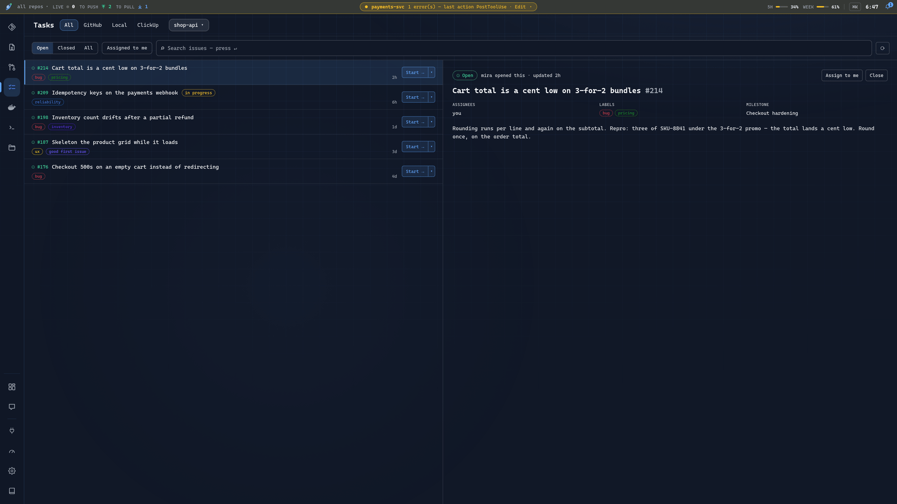
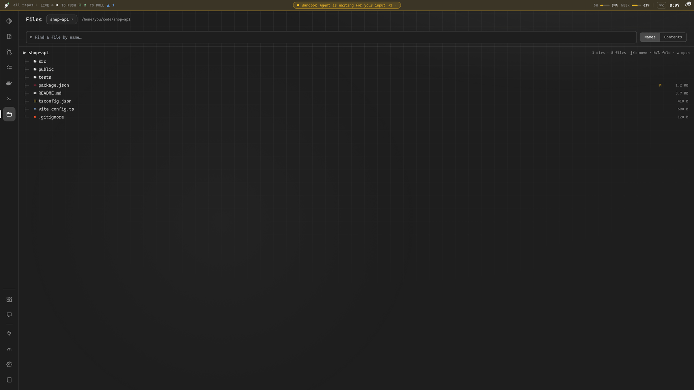
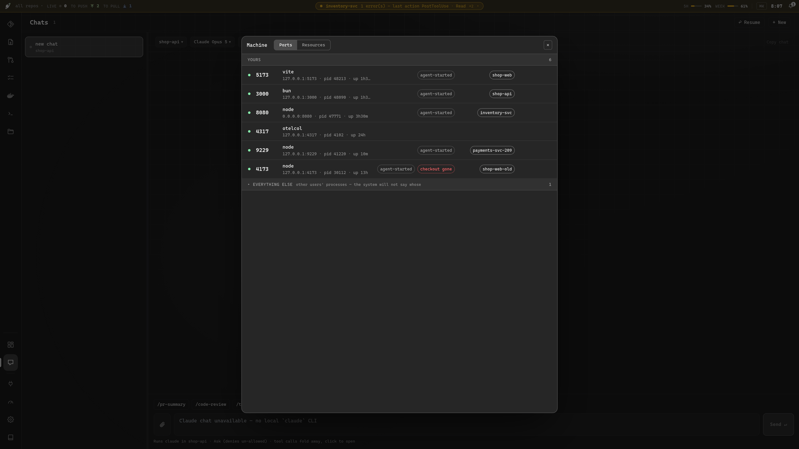
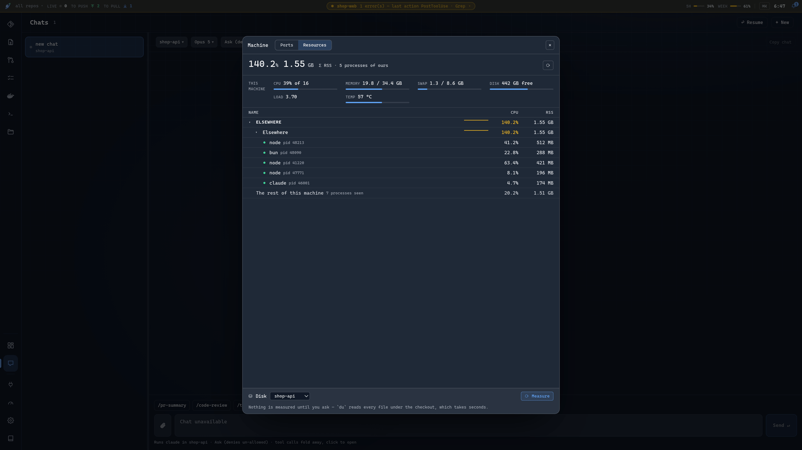
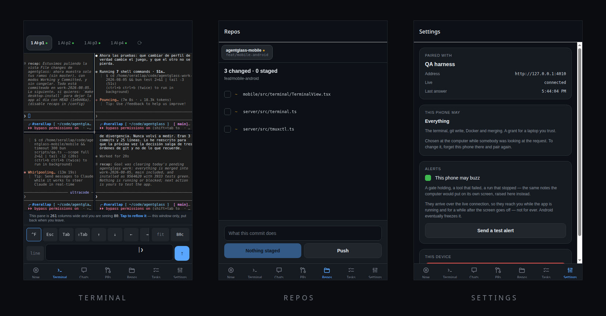
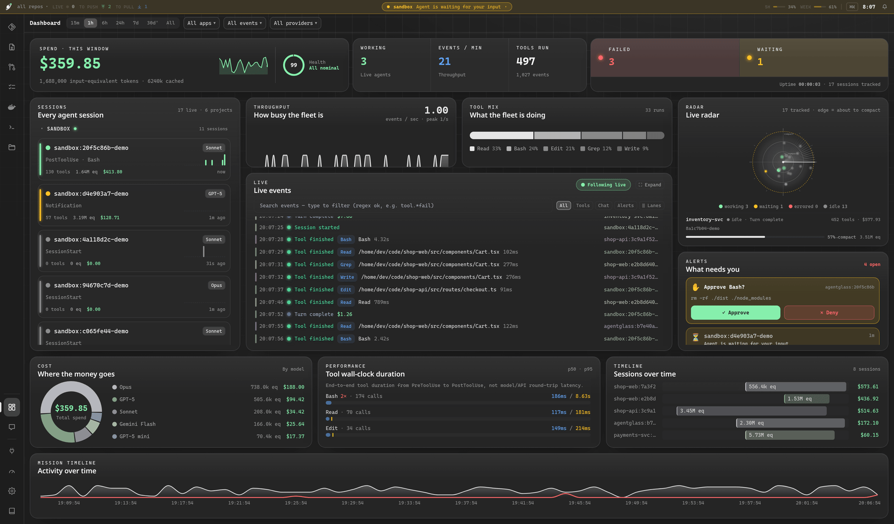

# The workspace

Everything the cockpit and its panels do, at the length the [README](../README.md)
deliberately does not have room for. Nothing here is needed to install the app;
it is what you find once it is open.

- [Every project, one cockpit](#every-project-one-cockpit)
- [More than a dashboard — a workspace](#more-than-a-dashboard--a-workspace)
- [Away from the desk — the phone app](#away-from-the-desk--the-phone-app)
- [Why](#why) · [Themes](#themes)

---

## Every project, one cockpit


agentglass watches **every** Claude Code session on your machine — you don't
launch it per-repo. Alongside the live hook stream, a **transcript scanner**
reads `~/.claude/projects` directly, so history from every project is there the
moment you open the dashboard, and new sessions tail in live (deduped against
the hooks, so nothing is double-counted).

Want to focus? **Scope the whole cockpit to a single project** — only that repo
(and its worktrees) show up, and its git / terminal / chat panels, diffs, and
spend are all you see. The natural way is the **in-app project picker**: on
first open (a desktop app has no "current folder", so it asks) you choose what
this cockpit is about, and the **⌂ name in the header** switches it any time:

- pick a **project** → that repo and its worktrees, nothing else;
- pick a **folder your projects live in** (e.g. `~/code`) → every repo from
  that folder inward;
- pick **All repos/projects** → no scope at all.

The choice is applied live and **persisted** (`root` in
`~/.config/agentglass/config.json`), so the next launch opens straight into it.
It can also be set from outside:

```bash
AGENTGLASS_ROOT=~/code/my-project bun run dev
# desktop:  AGENTGLASS_ROOT=~/code/my-project agentglass
```

Leave everything unset and it covers the whole machine. You can also pin the
repo sweep to specific directories via `AGENTGLASS_REPO_DIRS`, or the same
config file:

```jsonc
{ "root": "~/code/my-project", "repoDirs": ["~/code", "/mnt/hdd/code"] }
```

---
---

## More than a dashboard — a workspace

Watching is only half of it. agentglass grew a set of **lazygit / lazydocker-style panels** — plus a real terminal, a Claude chat, GitHub issues and a file browser — that live right in the app, so you can go from *seeing* what the fleet did to *acting* on it without leaving the tab. Keyboard-driven, and they wear the same 22 themes.

The 0.8 redesign made the workspace **the whole window** rather than a modal over the dashboard. A **rail** down the left switches between the views, and the dashboard — the cockpit above — is now the first of them, one key away whenever you want it back. Every view has the same fixed-height title bar and the same list width, so switching changes the panel and nothing else moves.

The rail carries **Dashboard** `1`, **Git** `g`, **Diff** `d`, **Pull requests** `p`, **Tasks** `i`, **Docker** `o`, **Terminal** `t`, **Chat** `c`, a **Browser** `b` where the build has one, **Files** `e`, **Clone** `u` and **Lantern** `l`. Drag it to reorder — put the terminal at the bottom if that is where your thumb goes — and the numbered shortcuts follow your arrangement, so the tooltips never start lying. Drag the seam beside any list to resize it; every view shares that width, and it is remembered.

**Two kinds of shortcut, because they answer different questions.** On the dashboard, bare letters jump straight to a view — `g` `d` `p` `i` `o` `t` `c` `e` `u` `l`. Inside any other view every keystroke belongs to whatever has focus, usually a shell, so navigation there carries a modifier: `Ctrl+1`…`Ctrl+N` walk the rail in order, `Ctrl+[` / `Ctrl+]` cycle it, and `Ctrl+\` (`⌘\`) toggles between the dashboard and the last view you were in. Both sets are rebindable in **Settings ▸ Shortcuts**, and the modified one takes any combination you like — `Ctrl+Alt+J` is recorded exactly as you hold it.


**Drag the rail to reorder it.** Put the terminal at the bottom if that is where your thumb goes; `Ctrl+1`…`Ctrl+N` follow your arrangement, so the tooltips never start lying. Drag the seam beside any list to resize it — every view shares that width, and it is remembered.

### 🔔 The bar — what is happening, above everything

A strip across the top of the window, always visible, whatever view you are in.

It carries what you would otherwise go looking for — commits **to push** and **to pull**, live **shells**, chats **waiting** on you, your Anthropic **5-hour and weekly plan meters**, a clock — plus a **bell** with everything that has happened while you were elsewhere, and one lane in the middle for the thing that just did.

And it mirrors **your machine's own notifications**: agentglass runs fullscreen, so the Slack banner your desktop draws is behind the app that is covering it. Those arrive as **cards** over the top-right corner — sender, message, and the link if the message carried one — and then wait in the bell. A copy, never an interception: your desktop still shows its own, and agentglass never becomes the notification daemon. Capability-probed on the server, so a platform without a notification bus says so instead of offering a switch that does nothing.

Two switches in **Settings ▸ Notifications**, because there are two sources. **From your desktop** is off by default (it reads every notification you receive) with a second choice of how much to show — who it was from, or the whole message — and a *quiet* mode that keeps collecting without interrupting. **From agentglass** is on, and turning it off silences chats finishing and branches falling behind while still letting anything *held waiting on you* speak. Neither switch stops the bell collecting: silence is about interruption, never about the record.

### 🔬 File changes — a syntax-highlighted diff & review workspace &nbsp;`d`

Every Edit/Write the fleet makes, gathered into one reviewable, chaptered list. **Shiki** syntax highlighting composed with a **word-level** intra-line diff, split or unified, ligatures and a per-diff theme, "reviewed" check-offs — plus one-click **✨ Explain** (a local-Claude walkthrough of the whole change set) and **⎇ Commit…** to turn a review straight into a commit.


### 🌿 Source control — lazygit, in the workspace &nbsp;`g`

A live view of any repo's working tree (repos are discovered from the fleet's own file paths). Stage / unstage / discard, **interactive hunk staging**, a commit composer, branches (checkout / create / delete), log, reflog, remotes, tags, worktrees and stashes — plus push / pull / fetch. Keyboard-driven (`j/k` move · `s/u` stage · `x` discard · `1`–`8` jump to a tab) and **write-gated**, so it's read-only until you opt in.

It also does the three things you would otherwise drop to a terminal for:

**Sync from base.** Pull `main` into the branch you are on, from the header, with the count of what is waiting. Disabled while the tree is dirty — merging over uncommitted work is how you lose it.

**Resolve conflicts.** Conflicted files are listed as what they are — files git has stopped in the middle of, not ordinary edits — so you cannot commit one with `<<<<<<<` still in it. Take a whole file's `ours`/`theirs` for the lockfile case, or open it **one by one** and choose a side per conflict block — or keep both, in either order — with both versions side by side and the common ancestor when git recorded one. Nothing is written until every block has an answer, because defaulting the ones you did not read is exactly how a merge quietly eats somebody's work.

**Undo the merge**, while that is still exactly reversible — only when nothing is committed on top and nothing is pushed. If either is true the button explains why instead of offering you a lie.


### 🔀 Pull requests — review one without opening a browser &nbsp;`p`


Every open pull request in **one repository at a time** — picked from a repo selector in the panel header, with the repo list discovered from the fleet's own file paths, like the git panel. It opens on **what is waiting on your review**, because that is the question a review dashboard exists to answer; if nothing is waiting it falls through to your own once, so it never lands on an empty pane. **Saved views** — *Needs my review, Mine, Failing, Ready, All* — are a scope and a query under one name, each carrying a live count where the scope is loaded and its last known one everywhere else. Each row carries its checks rolled into one dot (hover for `passed · failed · skipped · running`) and a `here` chip when this checkout is on that branch.

Above the tabs, a **masthead** that survives them: state, number and title, then author, branch, size, reviewers, assignee and milestone, the labels, and a `⋯` menu for the things you do to a pull request rather than in it — retitle, request a review, edit labels, convert to draft, copy the link, hand it to Claude, close it. Open Files and you still know whose change you are reading. Check states arrive in a **second batched pass** after the list itself lands — until it returns the dot is grey and reads `Checks…`, the header says *Loading check states…*, and rows with unknown checks are deliberately kept by the filter rather than hidden. That is what keeps the list itself instant.

**Filter it the way you filter GitHub.** Below the saved views is a query box plus eight multi-select facet menus — **Author, Label, Reviews, Checks, Draft, Base, Assignee, Milestone** — each showing a live count per option, a **Sort** pill, a removable chip per active filter and an "N of M" count. The query string is the single source of truth: `key:value` tokens plus bare words, keys case-insensitive, double quotes for values with spaces (`label:"needs review"`). Keys are `author`, `label`, `review`, `checks`, `is`, `base`, `assignee`, `milestone` and `sort`. Semantics are **OR within a facet, AND across facets** — two authors widens, adding a label then narrows. Bare words match the PR number, title or author, and `sort` takes `recently-updated` (default), `newest`, `oldest`, `most-changed`, `title` or `checks`. Unknown keys, half-typed tokens and unclosed quotes degrade to free text rather than emptying the list. Picking a saved view writes that view's query into the same box, so the chips still show what is on and still take it off again; edit it and the view row says **Custom** rather than claiming you are still in one.

```
author:sirallap label:bug is:draft sort:checks
```

Keyboard-driven both sides: in the list, `j`/`k` (or ↓/↑) move the selection and reset the detail to overview, `/` jumps into the query box, `Esc` clears it. In a PR's **files** tab, `j`/`k` walk the file list, `n`/`p` jump hunk to hunk, `x` marks a file viewed and `↵` folds it — the same keys the File changes modal uses, with the legend on screen. None of them fire while a query or comment box has focus.

Open one and it has **overview · conversation · commits · files · checks · review**. The diff is the app's own viewer — the same `SplitDiff` / `UnifiedDiff` the file-changes panel uses, keybindings and all, rather than a second implementation that drifts — and it reads **per file or per commit**, with merge commits marked as the trunk catch-ups they are so you do not review them as work.

**The conversation is one timeline, and the machines are turned down rather than interleaved.** Reviews, comments, line threads and the events between them read in the order they happened, on a single rail, oldest first or newest first. On a real review, four issue comments were all from CI and one coverage table alone was 46,551 characters, so automation collapses to a digest with the original a click away. Everything a person wrote renders as real markdown at a reading measure, because prose set to the full width of a 2000px window is unreadable however correctly it is formatted. A composer sits at the end, where a conversation ends, with Write and Preview.

**Files opens open.** Every file's diff is expanded from the start — that is how you read a change — and each one mounts as it comes near the viewport, so a sixty-file pull request scrolls instead of stalling; anything over 600 changed lines starts folded, because a regenerated lockfile is not what the tab should open on. Per file there is a **Viewed** switch rather than a tick, since viewed is state you keep for the length of a review, and the bar above carries a path filter, Unified / Split / Wrap, collapse-all and how many of the files you have got through.

**Reviews work the way GitHub's do.** Line comments queue as drafts (a `pending` chip counts them) and go up together as one review — approve, request changes or comment — so a half-finished review never lands in someone's inbox a line at a time. Threads belong to the review that opened them, are anchored to the code they are about, link out when you do want the browser, and the app declines to let you approve your own pull request.

**A PR's overview is also where you act on it.** It leads with whether the thing can land and what is stopping it, each blocker linking to the tab that would fix it. Squash-and-merge (pinned to the head SHA, so a push you have not seen makes GitHub refuse; optionally deleting the branch), enable auto-merge, close, update the branch from base, convert to or from draft, re-run failed checks — merges and closes behind a confirm dialog. The description is **editable in place**, with Write and Preview, and any checklist in it gets a progress bar. And **Review with Claude**: it opens the chat panel on this project with the review prompt already written, pinned to the PR's head SHA and pointed at `gh pr diff` for the change itself. It writes nothing — no fetch, no checkout, no directory left in your repository — and the prompt waits in the composer rather than sending itself, so the run starts when you say so. Same trick behind **Ask Claude why** on a failing check, which hands over the job that broke instead of the whole diff.

Check results notify you only for the pull requests you have a stake in — the ones you authored (**mine**) and the ones waiting on your review. Browsing **all** shows every PR's check state but never pushes a notification, and each PR notifies once per verdict however many checks it runs.

Nothing blocks on the network: the server has one thread, so every read is a cached answer that shows its own age. Check states come back in **one batched GraphQL query** rather than a subprocess per pull request, which is what makes a fifty-row list affordable.

### ✅ Tasks — every issue and to-do you owe, in one place &nbsp;`i`

GitHub issues for one repository, your own local to-do list, and ClickUp, under a single rail tab. The GitHub half opens on what is assigned to you, each row carrying its labels, its assignee, the comment count and how long since it moved. Open one and the column beside it reads the whole issue — body, labels, milestone, assignees, open or closed — and **Start →** turns it into work: a worktree, a plain branch, or a tmux window with Claude and the prompt already written, so a task goes from *read* to *being worked* without a detour through the terminal. An issue already underway wears an **in progress** chip, because the app knows which worktrees it started.



### 🐳 Docker — lazydocker, in the workspace &nbsp;`o`

Containers, images, volumes and networks in one **stacked column** whose headers never leave — so "is anything dangling?" is answerable without navigating away from the container you are watching. Containers group by compose project with live CPU / memory in aligned columns, and a **dense** toggle drops the image line when you would rather fit more on screen.

Select one and the pane beside it carries **logs · info · env · config · top**, with the logs coloured by level and pinned to the bottom while they stream. **exec** drops you into a shell inside that container — in the console already docked below, so your history and any running job survive it. Start / stop / restart / rm per container, and start / stop / restart across a whole compose project at once (`rm` stays per-container), with each bulk action hidden when it would do nothing. Same keyboard-first feel, same write-gate.


### ▶ Terminal — a real shell, in the workspace &nbsp;`t`

Not a command-runner imitation: the server opens **your login shell inside a
real PTY** (xterm.js in front, a pseudo-terminal behind a WebSocket), in any
repo/worktree the fleet has touched. Job control, `Ctrl+C` / `Ctrl+R`,
tab-completion, colors, `vim` / `htop` / `lazygit` — everything a local terminal
does. Sessions are **per-repo and persistent**: close the panel mid-build,
reopen later, the job is still running with scrollback intact.

The PTY backend is **POSIX-only**, so on a Windows *host* the Term view is
present but disabled and says why — ConPTY is not implemented yet. The decision
is made on the server, not in the browser, so a Windows *browser* pointed at a
Linux or macOS server still gets a full shell.

The **⚙ commands** menu makes every project command self-explanatory and one
click away — and it covers the **whole selected project**, not just its root:
**Makefile targets with their descriptions** (from `## comment` annotations or
the `# comment` above each target) plus **`package.json` scripts**, discovered
in the repo root *and* its subfolders. A monorepo's nested commands come out
ready to run (`make -C api test`, `bun run --cwd web dev`), grouped by folder
in the menu, each with the right runner (`bun` / `npm` / `pnpm` / `yarn`)
detected from that folder's lockfile. agentglass's own `Makefile` is annotated
this way — `make help` prints the same list in the shell.

Run **tmux** in it and the panel adopts its windows as its own tabs. The list
comes from tmux, the pixels come from agentglass: click to switch, `+` for a new
window, double-click to rename, and tmux's own status line steps aside (one
click brings it back, and it is restored when the panel closes). Nothing about
the keyboard changes — `^b c`, `^b n`, `^b 2` and everything else still go
straight to tmux, and the tabs follow. The point is that the window list stops
being the one strip of the workspace themed by whichever `.tmux.conf` the
machine happens to carry.

**If a shell ever renders solid white,** switch **Settings ▸ Preferences ▸
Terminal renderer** to *Compatibility*. xterm's GPU renderer is fast, but on
some Linux GPU/compositor stacks it paints the terminal blank with no catchable
context-loss event — so the default (**Auto**) uses the GPU on macOS and Windows
and the DOM renderer on Linux. *GPU* forces WebGL back on anywhere; a real
context loss still drops that session to DOM permanently. The choice applies to
newly opened shells, and is separate from `AGENTGLASS_GPU`, which is the
Electron window compositor rather than xterm.


### 💬 Chat — drive Claude, Codex and Antigravity sessions from the browser &nbsp;`c`

Multi-chat against your **local `claude`, `codex` or `agy` CLI**: pick a repo/worktree,
a model, and a permission mode (plan → default / acceptEdits → bypass), then converse —
replies stream in, tool calls appear as chips, and follow-ups resume the same
session. Sessions you start here show up in the fleet like any other agent.

#### Which models the Chat panel offers

Every list is the CLI's own answer rather than a table in this repo. Codex reads
its `models_cache.json`; Antigravity answers `agy models`. Claude Code publishes
no list at all — there is no `claude models` subcommand, no `--list-models`, and
nothing cached on disk — so its catalogue lives in
[`shared/claude-models.json`](../shared/claude-models.json).

It is **data, not code**: edit that file and the dropdown follows on the next
request. No rebuild, no restart.

```json
{ "id": "claude-opus-5", "display_name": "Claude Opus 5", "status": "active",
  "release_date": "2026-07-24", "scheduled_shutdown_date": "2027-07-24" }
```

A model is offered until its `scheduled_shutdown_date` has passed — that date is
the last day it appears, so it drops out the day after, and the panel stops
offering retired models without anyone editing anything. `status` is recorded for
the reader and is deliberately *not* a filter: a `superseded` model still answers
until it is actually retired, and hiding it early would remove a choice that
works. A row with no shutdown date never expires, which reads as "no retirement
announced".

To change the list without touching the checkout — a packaged install, or a
read-only one — put your own copy at `~/.config/agentglass/claude-models.json`,
or point `AGENTGLASS_CLAUDE_MODELS` at a file. Ids are validated against the same
expression that guards the spawn, so an entry that could not be sent is never
offered.

#### A second agent: OpenAI Codex

The same panel drives **`codex`** as well. When both CLIs are on the machine an
agent picker appears next to the repo — it is switchable until the chat has a
thread, then frozen, because a resume id belongs to the CLI that minted it and
there is no meaning to handing a live conversation from one to the other.

Codex brings its own vocabulary rather than borrowing Claude's. Its modes are
filesystem sandboxes (**Read-only**, **Write in this repo**, **⚡ Full access**)
instead of per-tool permissions, so there is no allowlist box for a Codex chat —
it decides at the filesystem boundary, not per tool call. The model list is read
from Codex's own `models_cache.json`, so it follows whatever your CLI currently
offers instead of a table in this repo that goes stale on every release. Pasted
and dropped images are Claude-only: `codex exec` takes images as file paths
rather than content blocks, so the panel says so instead of dropping them
silently.

A Codex chat shows **tokens but no cost and no context meter**. `codex exec`
reports neither a price nor a per-turn prompt size, and a bar drawn at 0 / 400k
would be a claim about a session we know nothing about. Its token counts are
cumulative for the whole thread rather than per turn, so they are assigned
rather than added up — and its input count includes the cached part, which is
subtracted back out so the "In" row means the same thing for both agents.

Install and authenticate the Codex CLI separately, then make sure the `codex`
executable is on the server's `PATH` when agentglass starts. The chat panel uses
`codex exec --json` for new turns and `codex exec resume` for follow-ups; it does
not replace the CLI's own login or configuration. Set `CODEX_HOME` when Codex
keeps its state somewhere other than `~/.codex` — the model cache and rollout
history are read from that location. To turn off the Codex integration while
leaving Claude chat available, set `AGENTGLASS_CODEX_DISABLED=1` before starting
the server.

#### A third agent: Google Antigravity

The panel drives **`agy`** as well — Google's agentic CLI, and a **separate
product from the Gemini CLI**: a separate binary with separate state, whose
model list spans Anthropic and open-weight models as well as Google's. Wiring
one does nothing for the other, and the Gemini CLI keeps its own OpenTelemetry
route onto the radar unchanged.

Its four modes line up with Claude's — **Ask**, **Plan**, **Auto-accept edits**,
**⚡ Bypass** — because it really does decide per tool call rather than by
drawing a line around the filesystem. The model list comes from `agy models`, so
it follows whatever your CLI currently offers. Like Codex, it takes images as
file paths rather than content blocks, so pasted images are refused with a
sentence instead of being dropped.

Two honest gaps, both consequences of Antigravity exporting no telemetry of its
own:

- **Only chats started here appear in the fleet.** Claude reports through hooks
  and Codex through OpenTelemetry; Antigravity reports through neither, so
  agentglass turns the frames of the turns *it* runs into events. An `agy` you
  ran in a terminal stays invisible.
- **There is no ↩ resume for it, and no cost or context meter.** Antigravity
  keeps each conversation as a SQLite database of protobuf blobs on an
  undocumented internal schema, so there is no history to replay; and the stream
  reports neither a price nor a context window. Tokens are shown, because those
  it does report.

Install and authenticate the CLI separately, and make sure `agy` is on the
server's `PATH` when agentglass starts. To turn it off while leaving the other
two, set `AGENTGLASS_ANTIGRAVITY_DISABLED=1`.

**↩ resume** picks up a session that already exists — including one you started
in a terminal — with its full context intact, and opens it against the CLI that
created it. Sessions that are still running are listed but can't be picked: a
session has a single owner, and a second writer on the same transcript corrupts
its history. For Codex the replayed history comes from its rollout in
`$CODEX_HOME/sessions` (`~/.codex/sessions` by default), since the OpenTelemetry
stream that puts Codex on the radar carries tool calls but none of the words.

**What a session shows:** the conversation is a **timeline**, not only a chat
log. Tool runs interleave with messages, each tool card carries the head of its
output (so a failing test is distinguishable from a passing one without leaving
the panel), and **subagents** report the parent's session id, so their tool
calls nest under the `Task` call that spawned them and fold away behind a
`… +N tool uses` toggle. Images are sent to the model as image blocks; other
files are quoted into the message. Type `/` in the composer to list and insert
skills/commands (slash commands are enabled in `-p`, they just weren't
discoverable).

---


---

### 📁 Files — browse and search a checkout, and open a file to edit &nbsp;`e`

A file tree for any checkout the fleet has touched, one level at a time so a repo with a `node_modules` in it stays cheap to walk. Two searches, because they are two questions: **Names** finds the file called X, **Contents** finds the code that says X. Open a file and it comes up in the app's own editor — the same one the diff viewer and the pull-request panel use — to read, or to edit and save.



### 🧬 Clone — a stand-in that works a queue in its own worktrees &nbsp;`u`

The Clone takes one task at a time from a queue you fill (or from the sources you point it at), cuts a **worktree of its own** off the current tip, seats an agent in it with a brief, lets the tests decide, and leaves the result on disk — a branch with commits, or a note saying why not. Nothing is ever pushed. It runs in **shifts** you open and close, with a cap on minutes and on tasks; the Work tab shows the queue, the run in flight, the pane to watch it in, and its hand raised when it needs a person.

Three things it learned the hard way. A run whose agent goes **quiet** — no new output, no transcript — is warned at ten minutes and stopped at twenty, not left to burn its whole budget. When the agent's **session limit** is hit, the Clone reads the hour the CLI announces, sleeps until then ("Asleep until 15:00" on the Work tab) and picks the work up on its own. And a fresh worktree is **seeded** with what git leaves out: `bun install` runs before the brief, and a `.worktreeinclude` at the repository root names the ignored files (`.env`, local settings) to copy in.

### 🔦 Lantern — who needs you, what every agent is on, and the way there &nbsp;`l`

The Lantern is the field: every agent on this machine, as **cards** — who it is (name, model, how long), where (checkout, branch, landed or not), what it is doing now (its own word, or its last tool call in the words that call carried), what it was last asked, what git has (commits over the base, files changed), the numbers (calls, turns, errors, cost, a **prompt-cache countdown**), and what it needs. Who **needs you** — a permission, a held gate — comes first, in red, and the rail's lantern carries the count from any view; a turn that merely ended is amber, its own group, not a number that follows you around.

It says things without being asked. A **watch** re-reads the field every fifteen minutes (Settings ▸ Agents ▸ Lantern) and sends one notification — the app's bell, the phone when paired, the desktop otherwise — when somebody is still stopped on you, a worker's window vanished, or claimed work has gone quiet for an hour. **Ask about the field** opens a chat on the floating bench with the field as its first message. **⏰ Schedule…** starts an agent later — "at 08:00, this prompt, in this checkout". **Hand off → Claude / Codex** on a card moves that conversation to another agent as a brief: the task as first asked, the last turns, the files touched, "continue, do not start over".

For scripts, `agentglass-agent` is the same field from a shell: `start`, `prompt`, `wait`, `read`, `send-keys`, `list`, `stop`, `schedule`.

### 🔌 Ports & Resources — what this machine is doing

Two tabs of a panel that opens from the foot of the rail, over whatever view you are in. **Ports** lists everything listening — the port, the process, the checkout it was started from, how long it has held the socket, and whether an agent started it — so "what is on 3000, and who started it" has an answer without reaching for `lsof`. It flags a server whose checkout was deleted underneath it, and the one process that is not yours it will name but never signal. **Resources** is the machine's own load — CPU, memory, swap, disk and temperature — with the fleet's own processes broken out from the rest, and a per-checkout disk measure a click away.





---
---

## Away from the desk — the phone app

The cockpit stays at the desk. A hunk-level diff and a docker table are not
things anybody drives with a thumb, and a narrower version of them is not a
phone app — it is the wrong app, smaller. So **a phone gets a different
application**: a native Android build that lives in [`mobile/`](../mobile/), pairs
with your machine over your own wifi, and reads the same server the cockpit
reads.

**It used to be a second web app**, and it could never do the one thing it
existed for. `crypto.subtle` is secure-context only, so a page served at
`http://192.168.1.20:4000` has no WebCrypto at all: it cannot generate the key
the pairing handshake is built on, and the phone on the sofa was exactly the
device that could not complete it. The app is not a page. It brings its own
P-256 (@noble, on Hermes — no secure context and no native module), so the same
handshake works unchanged over plain HTTP on the network you are already on —
and the handshake itself did not move to meet it: not a route, not a field.

It is **not in a store**, and it no longer needs to be. Releases carry a
signed `agentglass-<tag>.apk`, built by CI from this repository and attached to
the [release](https://github.com/SirAllap/agentglass/releases/latest) beside the
desktop installers — check the release you are on, since the Android job is
separate from the desktop one and a release can land without it. Open that page
on the phone, download the `.apk`, and let
Android install it when it asks whether this browser may — that is the whole
procedure. It wants a phone that can reach the machine (your own wifi, or the
tailnet), and it asks for notification permission the first time you turn
buzzing on. Pairing is the handshake described below.

Building it yourself instead — Expo, Metro, and your own device or emulator —
is [`mobile/README.md`](../mobile/README.md): the two commands and the traps.

### Seven tabs

| Tab | What it is for |
|---|---|
| **Now** | The queue below: everything that wants a decision, in one list you can empty. |
| **Terminal** | The machine's **real tmux panes**, as tabs — not a second empty prompt. Open one and you are looking at what is on that screen right now: the agent mid-turn, the build that failed, the rebase waiting on a decision. It joins as its own grouped session with `window-size largest`, so attaching from the sofa does not drag a 200-column session down to phone width on the desk. A key bar carries what a software keyboard has no room for — Escape, Tab, the arrows, `^C`, and the tmux prefix. |
| **Chats** | The same conversation you left at the desk, and still the same one when you sit back down: the session lives on the server, not on this phone. Scoped to **Live** when anything is running, because that is almost always why you reached for it. |
| **PRs** | Per repository, with the three things that decide whether you open it at all on the row itself — is CI red, has somebody approved, how big is it. The check rollup costs about four times the rest of the row, so it arrives on a second pass and says `checks…` until it does rather than claiming there are none. |
| **Repos** | Every checkout, not one per repository — linked worktrees answer with the same pull requests but have their own uncommitted work. A switch per file **is** the staging; then a title, Commit, and Push if the branch is ahead. |
| **Tasks** | Your board's own views, in the order the workspace has them, in the colours it gave them — a phone showing a different slice of the board than the computer is a second place to keep in your head. |
| **Settings** | What this phone is paired to, what it was granted, and whether it may buzz. |



### The home screen is a queue, not a dashboard

That is the whole difference: a dashboard is something you re-read, and this is
something you can **empty**. Every card is one decision carrying its own action,
and answering it takes the card out of the list.

| Card | What it is, and what you can do about it |
|---|---|
| **Blocked · waiting on you** | A gate. The agent is stopped dead until you answer, so this outranks everything: allow or deny, with the command it wants to run in front of you. |
| **Container down** | A container that exited non-zero, is restarting, or is dead. Tail the log, restart it, or hand it to Claude. |
| **CI went red** | The failing check on one of your pull requests. Open the log, or re-run it. |
| **Ready to merge** | Approved, checks green, nothing in the way. The one card that finishes work rather than starting it. |
| **Review requested** | Somebody asked for your eyes. Opens the pull request, diff and all. |
| **Stopped · wants direction** | A session that ended its turn and has gone quiet — between four minutes and twelve hours. Under four it is probably still thinking; over twelve it is yesterday's problem, not tonight's. |
| **Stopped part-way** | A checkout left mid-rebase, mid-merge or mid-cherry-pick. Nothing is running there and nothing will until somebody finishes it. |

Ordered by what it costs you to be away: blocking a person first, then broken,
then finished-and-waiting, then everything else — and within a rank, newest
first. A card you are not going to deal with tonight can be snoozed, and it
comes back when it changes.

The diff is unified, wrapped, with a `+` or `−` glyph on every line as well as
the tint — at 11.5px, outdoors, in one hand, colour alone is not a signal to
rely on, and for a good number of people it is not a signal at all.

### Getting it onto your phone

**Settings ▸ Remote access**, one switch to open the port. Then adding a device
is its own small handshake, and it is deliberately not one step.

The pane shows a **QR code and six digits**. Scan the code with the app — or
paste the link it encodes, which carries the address as well as the ticket —
type the digits, and a request appears back at the computer, naming the device,
the address it came from and the same six digits. It waits for somebody there to
accept. Nothing exists until they do, and **the ticket is good for two minutes**:
the app counts them down on both screens, because an invitation that has quietly
expired looks exactly like a phone that cannot reach the machine.

That shape is the point. **The QR is an invitation, not a key.** It used to be
the machine's own token, which meant a photograph of this screen, a screenshot
in a chat or a shared window in a call was a working shell on your laptop; there
is no way to scan a code carefully, and being able to see it was the whole
authorisation. Now seeing it gets you a form asking for six digits that are not
in the picture. The credential itself is minted only after a person agrees, and
it is encrypted to a key the phone generated for that one pairing — so on a
network without TLS, everything else on the wifi can watch the entire exchange
and still not have it.

Each device is then **its own thing**: named, at a level you chose while looking
at the request, and revocable on its own.

- **Look only** — sessions, costs, changes, pull requests. Approves nothing.
- **Answer things** *(the default)* — the above, plus approving gates and
  replying to a running session. What a phone is actually for.
- **Everything** — the terminal, git write, Docker, merging. A grant for a
  device you trust, and the one the **Terminal** tab needs: a real PTY on your
  machine is not something to hand out by default, so `/terminal/pty` refuses
  anything less.

The app is shown its own grant rather than left to discover it: a phone paired
to **Answer things** gets the list of changes and no commit button. Hiding a
button never stopped anything — the scope is checked on the route, per request —
but a button that answers "you may not" is a worse way to learn it than a screen
that never offered it.

**Forget** one device and only that one stops working: its credential is
revoked, the sockets it is holding are closed, and the desk and every other
phone carry on. Rotating the code is still there for when you have lost the code
itself, and still kicks everything.

It is **your network only** — the server binds to the LAN. The same pane will
tell you when a host firewall is dropping the packets, because otherwise
"nothing answered at 192.168.1.20" is all anyone gets, and that sentence is
equally true of a machine that is switched off. Over café wifi, pair on the
Tailscale address it offers instead: that one is encrypted end to end.

The cockpit itself still opens in a phone browser, and the page ships a web
manifest so **Add to home screen** gives it an icon that opens without browser
chrome. Pairing one, though, needs a secure context for the same WebCrypto
reason as ever — so it is the tailnet HTTPS address that works there, never
`http://192.168.…`. That is what the app is for.

### Reaching it when you are not on the same wifi

The honest answer is **Tailscale**, and it is the one the Remote pane offers
beside the LAN address. A tailnet address is reachable from a train, encrypted
end to end, and limited to devices signed into your own account — which is a
much narrower grant than a network. Install it on both ends, pair on that
address, and the sofa and the airport work the same way.

The tempting answer is a tunnel — `cloudflared`, `ngrok`, a reverse proxy — and
it is worth being plain about what that is. **This server can open a shell, push
to your repositories and control Docker on the machine it runs on.** Putting a
public hostname in front of it means the only thing between the internet and
that is a credential, and credentials leak by being pasted into the wrong
window. Treat the port the way you treat `sshd`: if you must put a proxy in
front of it, terminate TLS there, require authentication at the proxy as well,
and set `AGENTGLASS_ALLOWED_HOSTS` so the DNS-rebinding guard knows the name.
It is not a configuration this project tests, and it is not one to reach for
because Tailscale looked like a bigger setup than it is.

Either way, **the tunnel is for the browser, not for the hooks.** Everything
that reports into agentglass — the Claude Code hooks, the OTel exporters, the
gate that holds a tool call — posts to the server on the machine it is running
on, at `http://127.0.0.1:4000`. It has to: the hook scripts refuse to send a
transcript anywhere but this host, precisely because a cloned repository can set
`AGENTGLASS_SERVER` in its own `settings.json` and would otherwise redirect your
prompts and file contents to somebody else. Pointing them at a public hostname
does not make anything work better, and turning off the guard to do it
(`AGENTGLASS_ALLOW_REMOTE=1`) is for the case where the server genuinely runs on
another machine — not for the case where you added a tunnel to it.

### Alerts on the phone, and what they honestly cover

**Settings ▸ This phone may buzz**, one switch. A gate holding, a tool that
failed, a run that stopped — the same notes the computer puts on its own screen,
raised on the phone instead. They ride **the live connection this device already
holds**: `{type:"alert"}` on the socket is the identical frame the desk turns
into a native notification, so there is no push service in the path, no account
anywhere, no device token held by anybody, and nothing to register.

**What that costs, said plainly: the app has to be alive to hear it.** Android
keeps the socket for a while after the screen goes off and then freezes the
process, so this reaches a pocket for a while and not for ever. The Settings
screen says so where you turn it on, rather than implying a guarantee it cannot
keep. **Send a test alert** is there because the alternative way to find out
whether it works is to miss the thing it exists for.

What is worth interrupting for is decided on the phone, and there are four
different ways to say no: you are **looking at the app** already (the queue is
on screen and updating, and a notification over the top of it is the app telling
you what you can see), it is the **same alert** inside ninety seconds (a
reconnect re-broadcasts, and a phone reconnects every time it comes out of a
pocket — without this, walking into the office buzzes once per lift door), the
server itself called it **worth knowing and not worth stopping for**, or it
arrives with **no title**, and a buzz with no explanation teaches people to
ignore the next one. Only an agent that is stopped and waiting on a person gets
Android's `max`. Making everything urgent is how a channel ends up switched off
in the system settings, where the app cannot see it and cannot ask again.

> **There was a Web Push route here, and it is gone.** It woke a locked phone
> through Google's or Mozilla's push service, with Allow and Deny drawn on the
> notification — and by the end nothing could subscribe to it: a service worker
> and `PushManager` need a secure context, so a phone opening the QR link at
> `http://192.168.…` had neither. The same measurement that ended the browser
> companion, one layer down. It left with the switch that turned it on, rather
> than staying as a route nobody could reach.

`AGENTGLASS_NOTIFY` is the desktop channel and does not gate this one: a paired
phone hears the socket whether or not the machine it watches has a screen.

---
---

## Why

agentglass is a **visibility layer, not a harness**: it doesn't run your agents
or impose a workflow on them — it shows you what they're actually doing, and
puts the controls (diff, commit, terminal, docker) next to what it shows.
Everyone's harness is their own; the missing piece is seeing through it.

Most agent dashboards show a live event feed and forget everything on refresh. agentglass adds the layer that actually answers *"what did this cost, what's slow, what's breaking, and how much of my plan is left?"* — across every provider and every project, wrapped in a fast, animated cockpit.

| Feature | What you get |
|---|---|
| 🛰 **Mission-Control cockpit** | Mission clock, live throughput, tool-mix, a sweeping agent radar (distance from centre = context window used — a blip at the edge is about to compact), plain-English event stream, and a "what needs you" alert center. |
| 🗂 **Every project, machine-wide** | A transcript scanner reads every Claude Code session on the machine — history is there on open, new sessions tail in live. Or scope the whole cockpit to one project (or one folder of projects) with the in-app picker. |
| 🖥 **Native desktop app** | Own window + icon and a **self-contained bundled server** — nothing to run in a terminal. Launch-at-login toggle, attaches to a running server instead of duplicating it. |
| 🔬 **Diff & review** | A real diff viewer for everything the fleet changed — Shiki highlighting + word-level diff, split/unified, AI **Explain**, and commit-straight-from-review. |
| 🌿 **Source control** | lazygit in the cockpit: stage, hunk-stage, commit, branch, stash, push/pull — live on any repo the fleet touched (write-gated). |
| 🐳 **Docker** | lazydocker in the cockpit: containers by compose project, live stats, a log viewer, start/stop/restart (write-gated). |
| ▶ **Real terminal** | A true PTY shell (your login shell) per repo/worktree over a WebSocket — persistent sessions, plus a described, ready-to-run list of every Makefile target & package script across the whole project, grouped by folder. |
| 💬 **Claude chat** | Drive local Claude Code sessions from the browser — model + permission-mode picker, streamed replies, resumable sessions that appear in the fleet. |
| 💰 **Cost & tokens** | Per-event, per-session, per-model USD from a tunable pricing table (input / output / cache-write / cache-read). |
| ⏱️ **Tool latency** | `PreToolUse`→`PostToolUse` pairing → real p50 / p95 / max per tool. |
| 📊 **Persistent analytics** | SQLite-backed. `/stats` over any time window survives reloads and restarts. |
| 🌐 **Any provider** | Claude Code hooks **plus** an OpenTelemetry OTLP receiver (`gen_ai.*` spans). Provider is auto-detected from the model **per event**, so a session that switched models is counted under each provider it actually used — then **filter the entire cockpit** (cost, tools, latency, sessions, radar…) by provider. A model no rule recognises lands in a real **Unknown** bucket you can select, rather than disappearing from every filtered view. |
| 🤖 **Per-model breakdown** | Cost & token split across every model — Claude, GPT, Gemini, and more — from a tunable pricing table. |
| 🧵 **Session lifecycle** | Timeline of every session: start→end, duration, tokens, cost. |
| 📈 **Anthropic plan usage** | 5-hour + weekly plan-limit meters — shown only when you're viewing Anthropic (the one provider with a usage API), on wide screens. |
| ⌨ **Command palette + shortcuts** | `Ctrl-K` to filter, switch theme, change window, export; `d` diffs · `g` git · `p` pull requests · `i` tasks · `o` Docker · `t` terminal · `c` chat · `e` files · `u` Clone · `l` Lantern · `k` skills · `s` stats · `/` search; click any event for full details; click an agent to filter to it. |
| 🎨 **22 themes** | 11 dark palettes (Midnight Purple, Forest, Ember, Nord, …), each with a light twin — instant switch, remembered. |
| 🔔 **Alerts** | A held gate reaches whatever is attached: the notch in the cockpit, a **native OS notification** on the desktop, and a paired phone over its own live socket — plus webhook (Slack/Discord), `notify-send` on a headless box and an optional in-app chime. |
| 💰 **Budgets** | *"No more than $40 a month on this repository."* Per-project and per-model, warned at 80% rather than only when you cross it, counted from the daily rollup as well as live events so a monthly budget really means a month. Settings ▸ Preferences. |
| 📤 **Export** | One-click CSV / JSON of all events. |

### Themes

22 palettes — 11 dark, each with a light twin. The two the app is serious on, the same dashboard in each:

| Dark | Light |
|---|---|
|  |  |

The rest — Midnight Purple, Forest, Ember, Nord, Deep Sea, Rosewood, Carbon and their light twins — switch instantly and are remembered.

---
